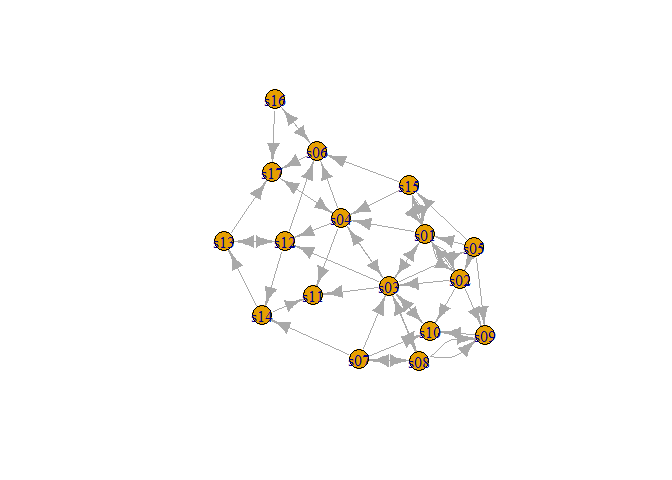
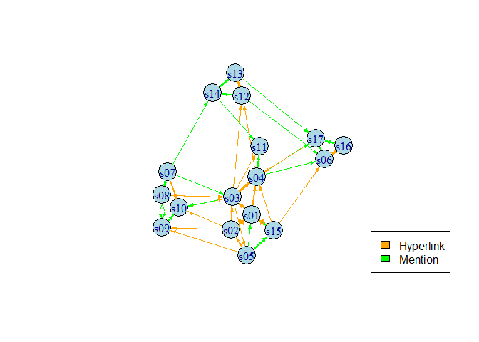
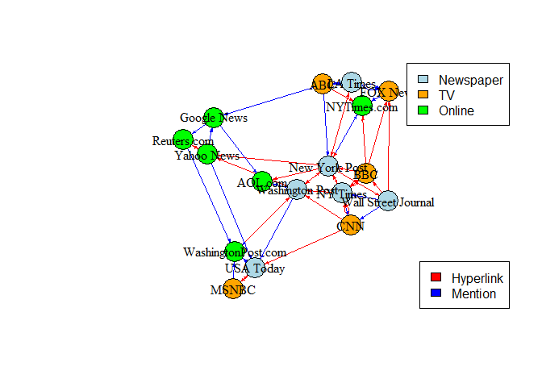

Comms_2
================
Sagnik Chand
2024-04-28

This follow-up blog serves as a continuation of our initial exploration
into the intricacies of cross-referencing networks within information
ecosystems. Here, our focus shifts towards delving into descriptive
network statistics and leveraging plotting functions to gain a deeper
understanding of our network graph. By scrutinizing these key aspects,
we aim to unravel the underlying dynamics and structural nuances
embedded within the information networks under study.

## Network Description

Now that we have framed our research question and hypotheses, let’s
proceed by importing our dataset files into R and initiating the
exploration of their network statistics and descriptions. In the realm
of network analysis, comprehending the descriptive characteristics of a
network is fundamental. It provides us with insights into the overall
structure, connectivity, and dynamics of the network. Understanding
these aspects is vital as it serves as a foundation for further analysis
and interpretation. By delving into network statistics and descriptions,
we can uncover patterns, identify influential nodes or media sources,
and discern underlying communication dynamics. This knowledge not only
enriches our understanding of the network but also guides us in
formulating hypotheses, designing analytical approaches, and deriving
meaningful insights from our data.

``` r
# Loading the required libraries

library(igraph)
```

    ## Warning: package 'igraph' was built under R version 4.2.3

    ## 
    ## Attaching package: 'igraph'

    ## The following objects are masked from 'package:stats':
    ## 
    ##     decompose, spectrum

    ## The following object is masked from 'package:base':
    ## 
    ##     union

``` r
library(tidyverse)
```

    ## Warning: package 'tidyverse' was built under R version 4.2.3

    ## Warning: package 'ggplot2' was built under R version 4.2.3

    ## Warning: package 'tibble' was built under R version 4.2.3

    ## Warning: package 'tidyr' was built under R version 4.2.3

    ## Warning: package 'readr' was built under R version 4.2.3

    ## Warning: package 'purrr' was built under R version 4.2.3

    ## Warning: package 'dplyr' was built under R version 4.2.3

    ## Warning: package 'stringr' was built under R version 4.2.3

    ## Warning: package 'forcats' was built under R version 4.2.3

    ## Warning: package 'lubridate' was built under R version 4.2.3

    ## ── Attaching core tidyverse packages ──────────────────────── tidyverse 2.0.0 ──
    ## ✔ dplyr     1.1.1     ✔ readr     2.1.4
    ## ✔ forcats   1.0.0     ✔ stringr   1.5.0
    ## ✔ ggplot2   3.4.3     ✔ tibble    3.2.1
    ## ✔ lubridate 1.9.2     ✔ tidyr     1.3.0
    ## ✔ purrr     1.0.1

    ## ── Conflicts ────────────────────────────────────────── tidyverse_conflicts() ──
    ## ✖ lubridate::%--%()      masks igraph::%--%()
    ## ✖ dplyr::as_data_frame() masks tibble::as_data_frame(), igraph::as_data_frame()
    ## ✖ purrr::compose()       masks igraph::compose()
    ## ✖ tidyr::crossing()      masks igraph::crossing()
    ## ✖ dplyr::filter()        masks stats::filter()
    ## ✖ dplyr::lag()           masks stats::lag()
    ## ✖ purrr::simplify()      masks igraph::simplify()
    ## ℹ Use the conflicted package (<http://conflicted.r-lib.org/>) to force all conflicts to become errors

``` r
# Reading in the CSV files

Edge <- read.csv("D:\\Umass\\2nd Semester\\DACSS 695N\\Assignments\\Project Presentation\\Data\\archive\\InputFileEdges.csv")

Node <- read.csv("D:\\Umass\\2nd Semester\\DACSS 695N\\Assignments\\Project Presentation\\Data\\archive\\InputFileNodes.csv")

# The edge file is the edgelist and the Node file is the node attributes. Let's take a glance at how they actually look.

head(Edge)
```

    ##   from  to weight      type
    ## 1  s01 s02     10 hyperlink
    ## 2  s01 s02     12 hyperlink
    ## 3  s01 s03     22 hyperlink
    ## 4  s01 s04     21 hyperlink
    ## 5  s04 s11     22   mention
    ## 6  s05 s15     21   mention

``` r
head(Node)
```

    ##    id               media media.type type.label audience.size
    ## 1 s01            NY Times          1  Newspaper            20
    ## 2 s02     Washington Post          1  Newspaper            25
    ## 3 s03 Wall Street Journal          1  Newspaper            30
    ## 4 s04           USA Today          1  Newspaper            32
    ## 5 s05            LA Times          1  Newspaper            20
    ## 6 s06       New York Post          1  Newspaper            50

``` r
# Now let us convert the edgelist into a network object.

Edge.m <- as.matrix(Edge)
Edge.ig <- graph_from_data_frame(Edge.m)

# We can look at summary descriptives using the Summary or Print function on the igraph object.

print(Edge.ig)
```

    ## IGRAPH e3bcc0f DNW- 17 51 -- 
    ## + attr: name (v/c), weight (e/c), type (e/c)
    ## + edges from e3bcc0f (vertex names):
    ##  [1] s01->s02 s01->s02 s01->s03 s01->s04 s04->s11 s05->s15 s06->s17 s08->s09
    ##  [9] s08->s09 s03->s04 s04->s03 s01->s15 s15->s01 s15->s01 s16->s17 s16->s06
    ## [17] s06->s16 s09->s10 s08->s07 s07->s08 s07->s10 s05->s02 s02->s03 s02->s01
    ## [25] s03->s01 s12->s13 s12->s14 s14->s13 s13->s12 s05->s09 s02->s10 s03->s12
    ## [33] s04->s06 s10->s03 s03->s10 s04->s12 s13->s17 s14->s11 s03->s11 s12->s06
    ## [41] s04->s17 s17->s04 s08->s03 s03->s08 s07->s14 s15->s06 s15->s04 s05->s01
    ## [49] s02->s09 s03->s05 s07->s03

``` r
summary(Edge.ig)
```

    ## IGRAPH e3bcc0f DNW- 17 51 -- 
    ## + attr: name (v/c), weight (e/c), type (e/c)

``` r
# We observe a total of 17 nodes interconnected by 51 edges within our network. This dataset includes additional information such as edge weights and the types of references associated with each edge.

is.directed(Edge.ig) # Our graph is directed as well.
```

    ## Warning: `is.directed()` was deprecated in igraph 2.0.0.
    ## ℹ Please use `is_directed()` instead.
    ## This warning is displayed once every 8 hours.
    ## Call `lifecycle::last_lifecycle_warnings()` to see where this warning was
    ## generated.

    ## [1] TRUE

``` r
vertex_attr_names(Edge.ig)
```

    ## [1] "name"

``` r
edge_attr_names(Edge.ig)
```

    ## [1] "weight" "type"

``` r
# Now lets find out our vertex names and edge weight values.

V(Edge.ig)$name # All the names are ID codes whose data is in the node attributes dataframe.
```

    ##  [1] "s01" "s04" "s05" "s06" "s08" "s03" "s15" "s16" "s09" "s07" "s02" "s12"
    ## [13] "s14" "s13" "s10" "s17" "s11"

``` r
E(Edge.ig)$weight
```

    ##  [1] "10" "12" "22" "21" "22" "21" "21" "11" "12" "22" "23" "20" "11" "11" "21"
    ## [16] "23" "21" "21" "21" "22" "21" "21" "21" "23" "21" "22" "22" "21" "21" " 2"
    ## [31] " 5" " 1" " 1" " 2" " 2" " 3" " 1" " 1" " 1" " 2" " 2" " 4" " 2" " 4" " 4"
    ## [46] " 4" " 1" " 1" " 1" " 1" " 1"

``` r
summary(E(Edge.ig)$weight)
```

    ##    Length     Class      Mode 
    ##        51 character character

Having acquainted ourselves with the fundamental descriptive statistics
of our network, let’s delve deeper into the analysis by examining the
statistics related to the presence of diads and triads within the
network. Understanding the distribution and prevalence of diads (pairs
of nodes) and triads (groups of three nodes) is crucial as it provides
insights into the underlying patterns of connectivity and interaction
within the network. By exploring these statistics, we can uncover
recurring motifs, detect patterns of clustering or segregation, and
identify potential structural motifs that shape the network’s dynamics.

``` r
# Let's start by doing a full diad census.

dyad.census(Edge.ig)
```

    ## Warning: `dyad.census()` was deprecated in igraph 2.0.0.
    ## ℹ Please use `dyad_census()` instead.
    ## This warning is displayed once every 8 hours.
    ## Call `lifecycle::last_lifecycle_warnings()` to see where this warning was
    ## generated.

    ## $mut
    ## [1] 10
    ## 
    ## $asym
    ## [1] 28
    ## 
    ## $null
    ## [1] 98

According to the dyad census function, the network contains 10 dyads
characterized by mutual ties, indicating that in these pairs of nodes,
both nodes are connected. Additionally, there are 28 dyads with
asymmetric ties, suggesting that in these pairs of nodes, one node is
connected to the other, but the connection is not reciprocated.
Furthermore, the function identifies 98 null dyads, indicating pairs of
nodes where neither node is connected to the other.

``` r
# Moving on to triad census.

triad_census(Edge.ig)
```

    ##  [1] 244 231  90  13  11  27  15  22   4   1   8   4   4   3   3   0

The triad census results from an igraph object provide a breakdown of
the different types of triads present within the network. Each number in
the result represents a specific type of triad, classified based on the
arrangement of connections between three nodes within the network.

\- 244: This indicates the number of triads classified as “transitive
triads” (also known as “transitivity” or “balanced triads”). In these
triads, all three nodes are connected, forming a closed loop or
triangle.

\- 231: This represents the number of “reciprocal triads,” where two
nodes are connected in both directions (reciprocated edges), and the
third node is not connected to either of them.

\- 90: This denotes the count of “star triads,” where one node (the
“hub”) is connected to the other two nodes (the “leaves”), but the
leaves are not connected.

\- 13: Indicates the number of “out-star triads,” similar to star triads
but with directed edges pointing outward from the hub node.

\- 11: Represents the count of “in-star triads,” analogous to star
triads but with directed edges pointing inward toward the hub node.

\- 27: Denotes the number of “mutual follower triads,” where each node
is connected to one other node, and the third node is not connected to
any of them.

\- 15: Indicates the count of “mutual friends triads,” where all three
nodes are mutually connected, forming a closed loop or triangle.

\- 22: Represents the number of “asymmetric triads,” where two nodes are
connected in one direction, but the third node is only connected to one
of them (not reciprocated).

\- 4: Denotes the count of “transitive triplets,” which are situations
where two nodes are connected, and one of them is also connected to a
third node, but the two nodes are not directly connected.

\- 1: Represents the number of “unconnected triads,” where none of the
three nodes are connected.

\- 8: Indicates the count of “cyclic triads,” where each node is
connected to the next node cyclically, forming a closed loop of three
nodes.

\- 4: Denotes the number of “intransitive triads,” where no nodes are
directly connected, resulting in a lack of transitivity.

\- 4: Represents the count of “isolated triads,” where each node is
isolated and not connected to any other node within the triad.

\- 3: Denotes the number of “doubly symmetric triads,” where each node
is connected to the other two nodes in both directions, forming a closed
loop or triangle with reciprocated edges.

\- 3: Indicates the count of “transitive tailed triads,” where two nodes
are connected, and one of them is also connected to a third node,
forming a transitive relationship with a tail.

By examining these triad census results, we can gain insights into the
structural motifs and patterns of connectivity present within the
network, which can inform further analysis and interpretation of its
dynamics and properties.

The triad information is indeed valuable, but to gain a more concise
understanding of the network’s transitivity, we’ll calculate the
transitivity score. While the triad census provides detailed insights,
it’s highly descriptive, and for a more succinct reference point, the
transitivity score offers a more comprehensive overview. Transitivity, a
network-level statistic, quantifies the proportion of connected triads
in the network that form complete triangles, ranging from 0 to 1. A
score of 0 signifies that none of the connected triads are transitive,
while a score of 1 indicates that all connected triads are transitive,
reflecting a fully interconnected network. Calculating the transitivity
score allows us to grasp the level of interconnectedness and cohesion
within the network more effectively.

``` r
# Calculating the transitivity score for this network.

transitivity(Edge.ig) # This is the Global Transitivity score.
```

    ## [1] 0.372549

``` r
# We can also calculate the Local Transitivity score.

transitivity(Edge.ig, type = "local")
```

    ##       s01       s04       s05       s06       s08       s03       s15       s16 
    ## 0.6000000 0.3333333 0.5000000 0.4000000 0.3333333 0.2500000 0.5000000 1.0000000 
    ##       s09       s07       s02       s12       s14       s13       s10       s17 
    ## 0.3333333 0.3333333 0.6000000 0.3000000 0.1666667 0.3333333 0.5000000 0.3333333 
    ##       s11 
    ## 0.3333333

A transitivity score of 0.372549 indicates that approximately 37.25% of
the connected triads in the network form complete triangles. In other
words, out of all the possible connected triads in the network, about
37.25% of them have all three possible links present.

This score provides insight into the level of clustering or
interconnectedness within the network. A higher transitivity score
suggests a higher tendency for nodes to form tightly interconnected
clusters, while a lower score indicates a more sparse or decentralized
network structure.

Now, let’s examine the structure of the network components. This
provides a list including the membership by node, the size of each
component, and the total number of components.

``` r
components(Edge.ig)
```

    ## $membership
    ## s01 s04 s05 s06 s08 s03 s15 s16 s09 s07 s02 s12 s14 s13 s10 s17 s11 
    ##   1   1   1   1   1   1   1   1   1   1   1   1   1   1   1   1   1 
    ## 
    ## $csize
    ## [1] 17
    ## 
    ## $no
    ## [1] 1

It appears that there is only one large component in this graph network,
and all of the 17 nodes are part of it, without any isolated nodes.

Having gained insights into the basic network description, including
diads, triads, transitivity scores, components, and structure, we now
aim to delve deeper into various node characteristics such as centrality
scores and community detection algorithms. To further explore our graph,
let’s proceed by creating visualizations using various plotting methods
to visualize its structure and patterns.

## Network Graph Plots

We will utilize the plot function to create visual representations of
our graph. Visualization is crucial for gaining insights into the
structure and patterns of the network, as it allows us to visually
inspect the connections between nodes and identify any prominent
features or clusters within the graph. By plotting the graph, we can
effectively communicate its complexity and characteristics, aiding in
our understanding and analysis of the data.

``` r
# Let's start with a simple Plot.  

plot(Edge.ig,
     directed = T)
```

    ## Warning in v(graph): Non-positive edge weight found, ignoring all weights
    ## during graph layout.

<!-- -->

This initial plot appears straightforward, depicting a well-connected
network without any isolated nodes. To enhance the visualization and
make it more visually appealing, we can add additional features and
customization options to our plot.

``` r
# Calculating the scaling factor for edge width

E(Edge.ig)$weight <- as.numeric(E(Edge.ig)$weight)

max_weight <- max(E(Edge.ig)$weight)
min_weight <- min(E(Edge.ig)$weight)
scaled_weights <- (E(Edge.ig)$weight - min_weight) / (max_weight - min_weight)
scaled_widths <- scaled_weights * 3

plot(Edge.ig,
     directed = TRUE,
     vertex.size = 20,
     vertex.color = "lightblue",
     vertex.label.size = 0.5,
     vertex.label.position = 2,
     layout = layout_with_fr,
     edge.arrow.size = 0.35,
     edge.color = ifelse(E(Edge.ig)$type == "hyperlink", "orange", "green"),
     edge.width = scaled_widths)

legend("bottomright",
       legend = c("Hyperlink", "Mention"),
       fill = c("orange", "green"))
```

<!-- -->

We’ve significantly enhanced the visual appeal of our plot by leveraging
various parameters available in the \`plot\` function. Our improvements
include adjusting the layout for better visualization, altering vertex
size and colors to enhance clarity, and employing distinct edge colors
to distinguish between different types of mentions among references.
Additionally, we utilized edge weights from the graph object to modulate
the width of edges in the plot. This comprehensive approach provides us
with a more comprehensive overview of the network, empowering us to
delve deeper into our analysis with greater clarity and insight.

Integrating node attributes from the node list into the edge list can
significantly enhance the richness and informativeness of network
visualizations. By incorporating additional node attributes into the
edge list, we create more detailed representations of network structure,
associating specific characteristics like platform type or audience size
with each edge. This approach provides a holistic view of patterns and
relationships within the network, enabling targeted analysis and
uncovering nuanced trends. By visualizing node attributes alongside edge
connections, correlations between node characteristics and connection
strength can be identified, offering valuable insights into network
dynamics and behavior. Overall, this integration enhances the
interpretability and utility of network visualizations, facilitating
comprehensive exploration and analysis of complex network datasets.

``` r
# Assigning node attributes to vertices in the edge list

Edge$from <- Node$media[match(Edge$from, Node$id)]
Edge$to <- Node$media[match(Edge$to, Node$id)]

# Plot the network with customized attributes

plot(Edge.ig,
     vertex.color = ifelse(Node$media.type == 1, "lightblue", 
                            ifelse(Node$media.type == 2, "orange", "green")),
     vertex.size = 20,
     vertex.label.size = 0.5,
     vertex.label.position = 2,
     vertex.label.color = "black",
     vertex.label.dist = 0,
     layout = layout_with_fr,
     vertex.label = Node$media,
     edge.color = ifelse(Edge$type == "hyperlink", "red", "blue"),
     edge.arrow.size = 0.25)

legend("bottomright",
       legend = c("Hyperlink", "Mention"),
       fill = c("red", "blue"))
legend("topright",
       legend = c("Newspaper", "TV", "Online"),
       fill = c("lightblue", "orange", "green"))
```

<!-- -->

The enhanced visualization provided by the graph above offers a deeper
level of insight and aesthetic appeal. Through the integration of node
attributes, we gain a richer understanding of the network dynamics.
Notably, certain vertices predominantly rely on hyperlinks rather than
direct mentions, suggesting varying modes of communication within the
network. Additionally, nodes such as “New York Times” and “Washington
Post” emerge as central figures, serving as focal points for a
significant volume of references. Further analysis could involve
exploring the degrees of these pivotal nodes and leveraging community
detection algorithms to delineate distinct clusters based on their
patterns of reference propagation. This comprehensive approach promises
to unveil intricate patterns of interaction and communication dynamics
within the network, facilitating a nuanced understanding of its
underlying structure.
