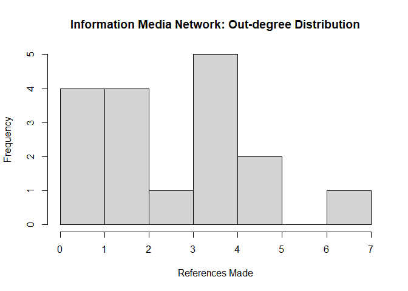
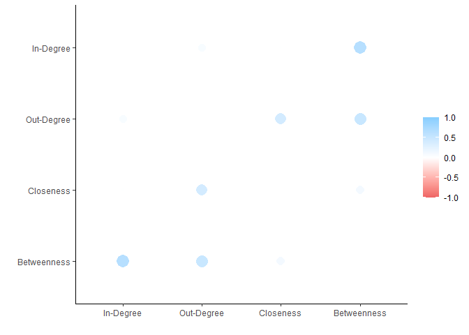
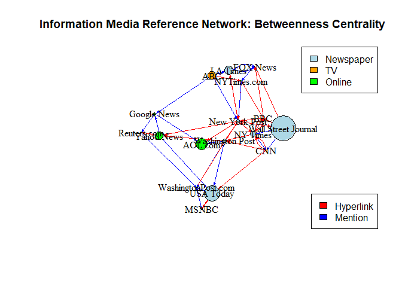
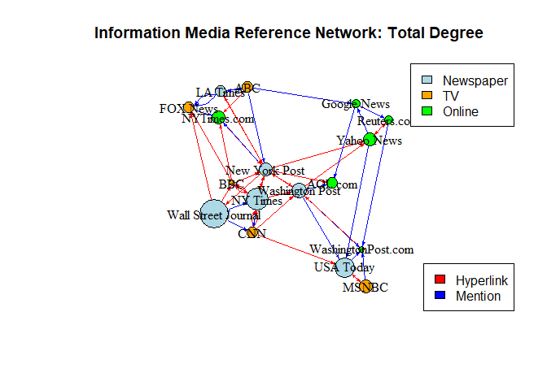

Comms_3
================
Sagnik Chand
2024-05-02

Welcome to the third installment of our blog series on social network
analysis for information media reference networks. In this blog, we
delve deeper into the intricacies of network centrality and
centralization values, aiming to gain a comprehensive understanding of
these crucial metrics.

Centrality measures play a pivotal role in uncovering the significance
and influence of individual nodes within a network. By analyzing
centrality metrics such as degree centrality, betweenness centrality,
and closeness centrality, we can identify key nodes and assess their
importance in the information dissemination process.

Join us as we explore the nuances of centrality and centralization in
our network graph, unraveling the underlying dynamics that shape
information flow and connectivity within the network. Let’s embark on
this journey of discovery and gain deeper insights into the structural
characteristics of our information media reference network.

## Centrality

Network centrality measures the importance or prominence of nodes within
a network by quantifying their structural positions and connections. In
the context of our research project, which aims to analyze information
networks, understanding centrality metrics is crucial for identifying
influential nodes that play significant roles in information
dissemination and network dynamics. These influential nodes may act as
key opinion leaders, gatekeepers, or hubs, shaping the flow of
information and influencing the behavior of other nodes in the network.
By investigating network centrality, we seek to uncover the underlying
structures and patterns that drive the spread of information, ultimately
contributing to a deeper understanding of network dynamics and
facilitating targeted interventions or strategies for maximizing the
impact of information dissemination efforts.

Let’s begin by examining the density of our network. Network density
quantifies the extent of connections present in a network by measuring
the proportion of actual ties compared to all possible ties within the
network. In our case, the network graph exhibits a density of 0.1875.
This level of network density indicates that approximately 18.75% of all
possible connections among nodes are realized in the network. Whether
this density is considered high or low depends on the specific context
and objectives of our analysis. Generally, a higher density suggests a
more densely connected network, potentially facilitating efficient
information flow and interactions among nodes. Conversely, a lower
density implies a sparser network with fewer connections, which may
indicate more isolated nodes or distinct subgroups within the network.

``` r
# Loading the required libraries

library(igraph)
```

    ## Warning: package 'igraph' was built under R version 4.2.3

    ## 
    ## Attaching package: 'igraph'

    ## The following objects are masked from 'package:stats':
    ## 
    ##     decompose, spectrum

    ## The following object is masked from 'package:base':
    ## 
    ##     union

``` r
library(tidyverse)
```

    ## Warning: package 'tidyverse' was built under R version 4.2.3

    ## Warning: package 'ggplot2' was built under R version 4.2.3

    ## Warning: package 'tibble' was built under R version 4.2.3

    ## Warning: package 'tidyr' was built under R version 4.2.3

    ## Warning: package 'readr' was built under R version 4.2.3

    ## Warning: package 'purrr' was built under R version 4.2.3

    ## Warning: package 'dplyr' was built under R version 4.2.3

    ## Warning: package 'stringr' was built under R version 4.2.3

    ## Warning: package 'forcats' was built under R version 4.2.3

    ## Warning: package 'lubridate' was built under R version 4.2.3

    ## ── Attaching core tidyverse packages ──────────────────────── tidyverse 2.0.0 ──
    ## ✔ dplyr     1.1.1     ✔ readr     2.1.4
    ## ✔ forcats   1.0.0     ✔ stringr   1.5.0
    ## ✔ ggplot2   3.4.3     ✔ tibble    3.2.1
    ## ✔ lubridate 1.9.2     ✔ tidyr     1.3.0
    ## ✔ purrr     1.0.1

    ## ── Conflicts ────────────────────────────────────────── tidyverse_conflicts() ──
    ## ✖ lubridate::%--%()      masks igraph::%--%()
    ## ✖ dplyr::as_data_frame() masks tibble::as_data_frame(), igraph::as_data_frame()
    ## ✖ purrr::compose()       masks igraph::compose()
    ## ✖ tidyr::crossing()      masks igraph::crossing()
    ## ✖ dplyr::filter()        masks stats::filter()
    ## ✖ dplyr::lag()           masks stats::lag()
    ## ✖ purrr::simplify()      masks igraph::simplify()
    ## ℹ Use the conflicted package (<http://conflicted.r-lib.org/>) to force all conflicts to become errors

``` r
# Reading in the CSV files

Edge <- read.csv("D:\\Umass\\2nd Semester\\DACSS 695N\\Assignments\\Project Presentation\\Data\\archive\\InputFileEdges.csv")

Node <- read.csv("D:\\Umass\\2nd Semester\\DACSS 695N\\Assignments\\Project Presentation\\Data\\archive\\InputFileNodes.csv")

# The edge file is the edgelist and the Node file is the node attributes. Let's take a glance at how they actually look.

head(Edge)
```

    ##   from  to weight      type
    ## 1  s01 s02     10 hyperlink
    ## 2  s01 s02     12 hyperlink
    ## 3  s01 s03     22 hyperlink
    ## 4  s01 s04     21 hyperlink
    ## 5  s04 s11     22   mention
    ## 6  s05 s15     21   mention

``` r
head(Node)
```

    ##    id               media media.type type.label audience.size
    ## 1 s01            NY Times          1  Newspaper            20
    ## 2 s02     Washington Post          1  Newspaper            25
    ## 3 s03 Wall Street Journal          1  Newspaper            30
    ## 4 s04           USA Today          1  Newspaper            32
    ## 5 s05            LA Times          1  Newspaper            20
    ## 6 s06       New York Post          1  Newspaper            50

``` r
# Now let us convert the edgelist into a network object.

Edge.m <- as.matrix(Edge)
Edge.ig <- graph_from_data_frame(Edge.m)
```

``` r
# Calculating density for the igraph object

edge_density(Edge.ig, loops = F)
```

    ## [1] 0.1875

Next, we’ll delve into calculating the degrees of nodes within our
network. Understanding node degrees, both in-degree and out-degree, can
provide valuable insights into the flow of references within the
network. In-degree represents the number of incoming references to a
node, indicating its popularity or influence within the network. On the
other hand, out-degree signifies the number of references made by a node
to other nodes, reflecting its activity in disseminating information. By
analyzing node degrees, we can identify the most referenced nodes as
well as those that reference others more frequently, shedding light on
the influential and active entities within the dissemination network.

``` r
# The `degree` command in igraph provides the degrees of nodes along with their names, facilitating easy identification of node degrees. Additionally, it includes self-loops by default, which may not be relevant for our analysis. Therefore, we can set the parameter to false to exclude self-loops from our degree calculations, ensuring a more accurate representation of node degrees within the network.

degree(Edge.ig)
```

    ## s01 s04 s05 s06 s08 s03 s15 s16 s09 s07 s02 s12 s14 s13 s10 s17 s11 
    ##  10   9   5   6   6  13   6   3   5   5   7   6   4   4   5   5   3

``` r
# We'll create a node attributes data frame to store these node characteristics, which will be instrumental for further econometric analysis.

# Obtaining degrees of all nodes
degrees <- degree(Edge.ig)

# Create a data frame with node names and degrees
node_attributes <- data.frame(Node = names(degrees), Degree = degrees, row.names = NULL)

# Ensure the node names are character type
node_attributes$Node <- as.character(node_attributes$Node)

# Print the data frame
print(node_attributes)
```

    ##    Node Degree
    ## 1   s01     10
    ## 2   s04      9
    ## 3   s05      5
    ## 4   s06      6
    ## 5   s08      6
    ## 6   s03     13
    ## 7   s15      6
    ## 8   s16      3
    ## 9   s09      5
    ## 10  s07      5
    ## 11  s02      7
    ## 12  s12      6
    ## 13  s14      4
    ## 14  s13      4
    ## 15  s10      5
    ## 16  s17      5
    ## 17  s11      3

``` r
# Adding the node degrees with the node names in a data frame.

node.attr <- data.frame(Name = Node$media,
                        Degree = node_attributes$Degree[match(Node$id,node_attributes$Node)])

# Printing the Data Frame

print(node.attr)
```

    ##                   Name Degree
    ## 1             NY Times     10
    ## 2      Washington Post      7
    ## 3  Wall Street Journal     13
    ## 4            USA Today      9
    ## 5             LA Times      5
    ## 6        New York Post      6
    ## 7                  CNN      5
    ## 8                MSNBC      6
    ## 9             FOX News      5
    ## 10                 ABC      5
    ## 11                 BBC      3
    ## 12          Yahoo News      6
    ## 13         Google News      4
    ## 14         Reuters.com      4
    ## 15         NYTimes.com      6
    ## 16  WashingtonPost.com      3
    ## 17             AOL.com      5

We can further analyze the individual node degrees to gain insights into
their influence within the network. Currently, it appears that the Wall
Street Journal holds the highest nodal degree at 13, closely followed by
the New York Times. These two sources seem to exert significant
influence within the network. Conversely, ABC News, FOX, and CNN exhibit
the lowest nodal degrees at 5, suggesting lesser prominence or influence
within the network. However, given that our graph is directed,
distinguishing between in-degree and out-degree can provide deeper
insights. In-degree signifies the number of references a node receives,
indicating its influence, while out-degree reflects the number of
references a node makes to other sources, indicating its activity level.
This distinction can further clarify which information sources are most
frequently referenced (thus influential) and which actively reference
other sources.

``` r
# Calculating the in-degree for the nodes in our network

degree(Edge.ig, mode = "in", loops = F)
```

    ## s01 s04 s05 s06 s08 s03 s15 s16 s09 s07 s02 s12 s14 s13 s10 s17 s11 
    ##   5   4   1   4   2   6   2   1   4   1   3   3   2   2   4   4   3

``` r
# Now we can append these values to our node attributes data frame.

# Storing the in-degree values in a data frame

in.degree <- data.frame(Name = names(degree(Edge.ig, mode = "in", loops = F)),
                        Degree = degree(Edge.ig, mode = "in", loops = F), row.names = NULL)

# Appending the in degree values to our node attributes data frame

node.attr <- node.attr %>% 
  mutate("In-Degree" = in.degree$Degree[match(Node$id,in.degree$Name)])

# Now moving on to calculate the out degree of our nodes

degree(Edge.ig, mode = "out", loops = F)
```

    ## s01 s04 s05 s06 s08 s03 s15 s16 s09 s07 s02 s12 s14 s13 s10 s17 s11 
    ##   5   5   4   2   4   7   4   2   1   4   4   3   2   2   1   1   0

``` r
# Appending it to the node attributes data frame

out.degree <- data.frame(Name = names(degree(Edge.ig, mode = "out", loops = F)),
                        Degree = degree(Edge.ig, mode = "out", loops = F), row.names = NULL)

node.attr <- node.attr %>% 
  mutate("Out-Degree" = out.degree$Degree[match(Node$id,out.degree$Name)])

# Doing a Sanity Check to see how our data frame looks like

print(node.attr)
```

    ##                   Name Degree In-Degree Out-Degree
    ## 1             NY Times     10         5          5
    ## 2      Washington Post      7         3          4
    ## 3  Wall Street Journal     13         6          7
    ## 4            USA Today      9         4          5
    ## 5             LA Times      5         1          4
    ## 6        New York Post      6         4          2
    ## 7                  CNN      5         1          4
    ## 8                MSNBC      6         2          4
    ## 9             FOX News      5         4          1
    ## 10                 ABC      5         4          1
    ## 11                 BBC      3         3          0
    ## 12          Yahoo News      6         3          3
    ## 13         Google News      4         2          2
    ## 14         Reuters.com      4         2          2
    ## 15         NYTimes.com      6         2          4
    ## 16  WashingtonPost.com      3         1          2
    ## 17             AOL.com      5         4          1

``` r
# Summary statistics for node attributes.

summary(node.attr)
```

    ##      Name               Degree     In-Degree   Out-Degree
    ##  Length:17          Min.   : 3   Min.   :1   Min.   :0   
    ##  Class :character   1st Qu.: 5   1st Qu.:2   1st Qu.:2   
    ##  Mode  :character   Median : 5   Median :3   Median :3   
    ##                     Mean   : 6   Mean   :3   Mean   :3   
    ##                     3rd Qu.: 6   3rd Qu.:4   3rd Qu.:4   
    ##                     Max.   :13   Max.   :6   Max.   :7

``` r
# Network In-degree distribution

hist(node.attr$`In-Degree`,
     main = "Information Media Network: In-degree Distribution",
     xlab = "References Received")
```

<!-- -->

``` r
# Network Out-degree distribution

hist(node.attr$`Out-Degree`,
     main = "Information Media Network: Out-degree Distribution",
     xlab = "References Made")
```

<!-- -->

Now that we have constructed this data frame, we can examine the degree
values for all nodes, including their total, in, and out degrees. Upon
initial inspection, it’s apparent that the Wall Street Journal, NY
Times, and USA Today are the top three information sources with the
highest total degree values. This indicates their significant influence
within the media reference networks. Additionally, an intriguing
observation is that all three are newspapers, highlighting the enduring
prominence of print media as primary information sources. Conversely,
ABC, Fox News, and CNN have the lowest total degree values, each at 5.
Remarkably, these three are television channels, suggesting a
comparatively lower activity level in referencing other media and
information platforms.

Let’s delve into the activity of referencing other media platforms by
examining the out-degree. The out-degree signifies the links outgoing
from the media platform to other platforms. From the data, we observe
that the Wall Street Journal, NY Times, and USA Today exhibit the
highest out degrees, with the Wall Street Journal leading with 7 links.
This implies that these newspapers are the most active in referencing
other media platforms in the network.

Similarly, analyzing the in-degree of the nodes allows us to identify
which media platforms are the most influential, as they are referred to
by others. Once again, the Wall Street Journal and NY Times lead in
degrees, with 6 and 5 ties, respectively. However, other platforms such
as USA Today, New York Post, Fox News, and ABC follow closely with 4
degrees each. It’s promising to see a variety of media platforms being
referenced by others. Nonetheless, the Wall Street Journal and NY Times
emerge as the most influential platforms in terms of information and
media sharing.

Let’s revisit our original hypothesis and assess its significance. Our
initial hypothesis regarding influence in the social network was:

*H1*: Information sources with a larger audience size are likely to have
more connections or references with other media platforms.

Now that we’ve identified the most influential social media platforms
with the largest number of connections in our network graph, we aim to
validate our hypothesis by comparing these nodes’ connection counts with
their audience sizes. The audience sizes of these information media
platforms are available in our nodelist. While these audience sizes are
scaled down for ease of comparison, they accurately represent the
essence of the actual numbers. Let’s review our data frame once more to
identify the media platforms with the largest audiences.

``` r
# Viewing the Nodelist data frame.

head(Node)
```

    ##    id               media media.type type.label audience.size
    ## 1 s01            NY Times          1  Newspaper            20
    ## 2 s02     Washington Post          1  Newspaper            25
    ## 3 s03 Wall Street Journal          1  Newspaper            30
    ## 4 s04           USA Today          1  Newspaper            32
    ## 5 s05            LA Times          1  Newspaper            20
    ## 6 s06       New York Post          1  Newspaper            50

``` r
# Viewing the relevant columns and arranging in descending order of audience size.

Node %>% 
  select("media","audience.size","type.label") %>% 
  arrange(desc(audience.size))
```

    ##                  media audience.size type.label
    ## 1             FOX News            60         TV
    ## 2                  CNN            56         TV
    ## 3        New York Post            50  Newspaper
    ## 4                MSNBC            34         TV
    ## 5                  BBC            34         TV
    ## 6           Yahoo News            33     Online
    ## 7              AOL.com            33     Online
    ## 8            USA Today            32  Newspaper
    ## 9  Wall Street Journal            30  Newspaper
    ## 10  WashingtonPost.com            28     Online
    ## 11     Washington Post            25  Newspaper
    ## 12         NYTimes.com            24     Online
    ## 13                 ABC            23         TV
    ## 14         Google News            23     Online
    ## 15            NY Times            20  Newspaper
    ## 16            LA Times            20  Newspaper
    ## 17         Reuters.com            12     Online

From the data frame, it’s evident that Fox News and CNN, both television
channels, boast the largest audience sizes. This aligns with
contemporary trends, where video sources dominate information
consumption. Following closely is the New York Post, a longstanding and
trusted newspaper. Surprisingly, some of the most influential platforms
in our network, like The Wall Street Journal, have relatively smaller
audience sizes compared to television channels. Despite this,
influential nodes such as The Wall Street Journal, The New York Times,
and USA Today don’t necessarily possess the highest audience sizes.
Based on this evidence, we can refute our initial hypothesis, which
suggested that the most influential media platforms, with the highest
number of connections, would also have the largest audience sizes.

For our secondary hypothesis we will need to utilize community detection
algorithms but before delving into community detection algorithms to
group our information media nodes based on shared properties, let’s
explore centrality concepts to better understand our graph. Calculating
various centralities for our nodes and appending them to our node
attributes data set will provide valuable insights. Centrality measures,
such as degree centrality and betweenness centrality, are crucial for
understanding the structural importance of nodes within a network. They
help identify key nodes that play significant roles in information
dissemination, influence, and network connectivity. By analyzing
centrality measures, we can uncover pivotal nodes and gain a deeper
understanding of the underlying network dynamics and relationships.

### Degree Centralization

``` r
# Calculating In-degree centralization for the network

igraph::centr_degree(Edge.ig, loops = FALSE, mode = "in")$centralization
```

    ## [1] 0.1992188

``` r
# Calculating Out-degree centralization for the network

igraph::centr_degree(Edge.ig, loops = FALSE, mode = "out")$centralization
```

    ## [1] 0.265625

As observed, the degree centralization for the network indicates a
higher out degree centralization compared to in degree centralization.
This suggests that there is greater variation in the number of outgoing
connections among nodes than in incoming connections. In other words,
certain nodes exert more influence by referencing or linking to other
media platforms more frequently than others, contributing to a more
centralized structure in terms of outgoing connections. This information
provides insights into the distribution of influence and connectivity
within the network, highlighting nodes that play significant roles in
disseminating information and shaping network dynamics.

### Closeness Centrality

``` r
# Calculating the node level attribute of closeness centrality.

closeness(Edge.ig)
```

    ##         s01         s04         s05         s06         s08         s03 
    ## 0.002666667 0.002645503 0.002754821 0.001342282 0.004672897 0.005208333 
    ##         s15         s16         s09         s07         s02         s12 
    ## 0.003184713 0.001338688 0.001808318 0.006134969 0.003584229 0.001508296 
    ##         s14         s13         s10         s17         s11 
    ## 0.001457726 0.002341920 0.004504505 0.002272727         NaN

``` r
close.centr <- data_frame(Name = names(closeness(Edge.ig)),
                          Centrality = closeness(Edge.ig))
```

    ## Warning: `data_frame()` was deprecated in tibble 1.1.0.
    ## ℹ Please use `tibble()` instead.
    ## This warning is displayed once every 8 hours.
    ## Call `lifecycle::last_lifecycle_warnings()` to see where this warning was
    ## generated.

``` r
# Now, we can integrate the values of closeness centrality into our node attributes data frame to enhance our statistical analysis.

node.attr <- node.attr %>% 
  mutate(Closeness = close.centr$Centrality[match(Node$id,close.centr$Name)])

head(node.attr)
```

    ##                  Name Degree In-Degree Out-Degree   Closeness
    ## 1            NY Times     10         5          5 0.002666667
    ## 2     Washington Post      7         3          4 0.003584229
    ## 3 Wall Street Journal     13         6          7 0.005208333
    ## 4           USA Today      9         4          5 0.002645503
    ## 5            LA Times      5         1          4 0.002754821
    ## 6       New York Post      6         4          2 0.001342282

``` r
node.attr %>% 
  arrange(desc(Closeness)) %>% 
  head()
```

    ##                  Name Degree In-Degree Out-Degree   Closeness
    ## 1                 CNN      5         1          4 0.006134969
    ## 2 Wall Street Journal     13         6          7 0.005208333
    ## 3               MSNBC      6         2          4 0.004672897
    ## 4                 ABC      5         4          1 0.004504505
    ## 5     Washington Post      7         3          4 0.003584229
    ## 6         NYTimes.com      6         2          4 0.003184713

Closeness centrality measures how close a node is to all other nodes in
a network, based on the sum of the shortest paths between that node and
all others. In our data frame, CNN exhibits the highest closeness
centrality of 0.006, followed by the Wall Street Journal and MSNBC. This
indicates that CNN is centrally positioned within the network, with
shorter average distances to other nodes compared to Wall Street Journal
and MSNBC.

### Betweenness Centrality

``` r
# Calculating the node level attribute of betweenness centrality.

betweenness(Edge.ig)
```

    ##        s01        s04        s05        s06        s08        s03        s15 
    ##  34.000000  91.333333  49.000000  21.500000  14.000000 145.833333   2.333333 
    ##        s16        s09        s07        s02        s12        s14        s13 
    ##   0.000000   0.000000   0.500000  23.666667  45.500000   1.000000  21.500000 
    ##        s10        s17        s11 
    ##  48.000000  66.000000   0.000000

``` r
bet.centr <- data_frame(Name = names(betweenness(Edge.ig)),
                          Bet.Centrality = betweenness(Edge.ig))

# Now, we can integrate the values of betweenness centrality into our node attributes data frame to enhance our statistical analysis.

node.attr <- node.attr %>% 
  mutate(Betweenness = bet.centr$Bet.Centrality[match(Node$id,bet.centr$Name)])

head(node.attr)
```

    ##                  Name Degree In-Degree Out-Degree   Closeness Betweenness
    ## 1            NY Times     10         5          5 0.002666667    34.00000
    ## 2     Washington Post      7         3          4 0.003584229    23.66667
    ## 3 Wall Street Journal     13         6          7 0.005208333   145.83333
    ## 4           USA Today      9         4          5 0.002645503    91.33333
    ## 5            LA Times      5         1          4 0.002754821    49.00000
    ## 6       New York Post      6         4          2 0.001342282    21.50000

``` r
node.attr %>%
  select(Name,Betweenness) %>% 
  arrange(desc(Betweenness)) %>% 
  head()
```

    ##                  Name Betweenness
    ## 1 Wall Street Journal   145.83333
    ## 2           USA Today    91.33333
    ## 3             AOL.com    66.00000
    ## 4            LA Times    49.00000
    ## 5                 ABC    48.00000
    ## 6          Yahoo News    45.50000

Betweenness centrality measures the number of shortest paths between
pairs of nodes that pass through a particular node. In our data set,
Wall Street Journal exhibits the highest betweenness centrality score of
145, significantly higher than USA Today and AOL.com. This suggests that
Wall Street Journal plays a crucial role in facilitating information
flow within the network, as it lies on many shortest paths between other
nodes. This finding supports our hypothesis that influential nodes may
not necessarily have the largest audience sizes.

Before proceeding to community detection in our network graph, let’s
generate a correlation plot using the four node attributes we’ve
collected: in-degree, out-degree, closeness centrality, and betweenness
centrality scores. This analysis will reveal the extent of correlation
among these scores.

``` r
# Loading in the required library.

library(corrr)
```

    ## Warning: package 'corrr' was built under R version 4.2.3

``` r
# Plotting the correlation graph.

node.attr %>% 
  select(-c(1,2)) %>% 
  correlate() %>% 
  arrange() %>% 
  rplot()
```

    ## Correlation computed with
    ## • Method: 'pearson'
    ## • Missing treated using: 'pairwise.complete.obs'

<!-- -->

The correlation plot illustrates a strong positive correlation between
betweenness scores and in-degree scores, indicating that nodes with more
incoming ties tend to have higher betweenness centrality scores. While
there is some correlation between out-degree and both betweenness and
closeness centrality scores, it is not as pronounced as the former
relationship. This analysis provides valuable insights into the
interplay between different centrality measures and their effects on one
another.

Before proceeding further, let’s create another visualization by
plotting the network graph with betweenness centrality and degree
centrality as node attributes. This will highlight the distinct nodes
that are more influential than others in the network.

``` r
# Using betweenness centrality scores to determine node sizes.

plot(Edge.ig,
     main = "Information Media Reference Network: Betweenness Centrality",
     vertex.color = ifelse(Node$media.type == 1, "lightblue", 
                            ifelse(Node$media.type == 2, "orange", "green")),
     vertex.size = node.attr$Betweenness*0.25,
     vertex.label.size = 0.5,
     vertex.label.position = 2,
     vertex.label.color = "black",
     vertex.label.dist = 0,
     layout = layout_with_fr,
     vertex.label = Node$media,
     edge.color = ifelse(Edge$type == "hyperlink", "red", "blue"),
     edge.arrow.size = 0.25)

legend("bottomright",
       legend = c("Hyperlink", "Mention"),
       fill = c("red", "blue"))
legend("topright",
       legend = c("Newspaper", "TV", "Online"),
       fill = c("lightblue", "orange", "green"))
```

<!-- -->

The graph clearly illustrates that newspapers have higher betweenness
centrality values compared to television or online sources of
information. This indicates that newspapers play a significant role in
the information media reference networks. Now, let’s utilize the total
degree scores of the nodes to further highlight the distinctiveness in
the plot.

``` r
# Using total degree scores to determine node sizes.

plot(Edge.ig,
     main = "Information Media Reference Network: Total Degree",
     vertex.color = ifelse(Node$media.type == 1, "lightblue", 
                            ifelse(Node$media.type == 2, "orange", "green")),
     vertex.size = node.attr$Degree*2.25,
     vertex.label.size = 0.5,
     vertex.label.position = 2,
     vertex.label.color = "black",
     vertex.label.dist = 0,
     layout = layout_with_fr,
     vertex.label = Node$media,
     edge.color = ifelse(Edge$type == "hyperlink", "red", "blue"),
     edge.arrow.size = 0.25)

legend("bottomright",
       legend = c("Hyperlink", "Mention"),
       fill = c("red", "blue"))
legend("topright",
       legend = c("Newspaper", "TV", "Online"),
       fill = c("lightblue", "orange", "green"))
```

<!-- -->

Once more, this graph emphasizes that newspapers exhibit a higher total
degree of centrality compared to television and online information
sources. This underscores the central role of newspapers in these
reference-sharing networks for information media platforms.
