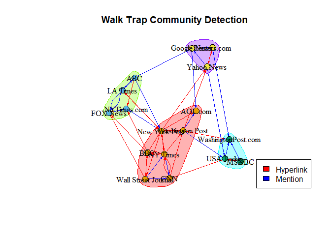
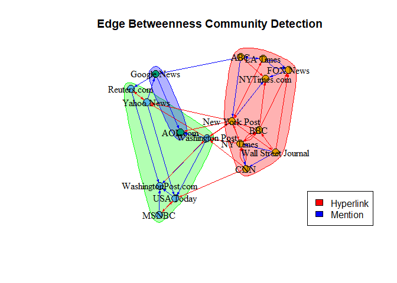
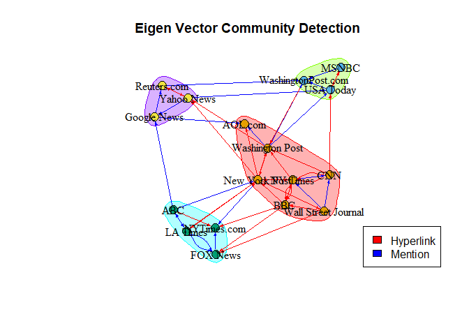

Comms_4
================
Sagnik Chand
2024-05-02

Welcome to the fourth installment of our social network analysis series!
In this blog, we delve into the realm of community detection algorithms
to unveil the intricate clusters and subgraphs within our network
dataset. By applying different algorithms, we aim to unravel the
underlying structures and patterns embedded within the network, offering
deeper insights into the connections and interactions among nodes. Join
us on this journey as we navigate through the complexities of our
network data and uncover its hidden gems.

## Community Detection

Community detection algorithms play a crucial role in analyzing networks
by identifying clusters or communities of nodes that share similar
attributes or behaviors. These algorithms use various parameters such as
modularity, edge betweenness, and eigenvector centrality to group nodes
into subgraphs based on their similarities. Understanding these
communities can provide insights into the structure and dynamics of the
network, helping to uncover patterns and relationships among nodes.

One of the commonly used community detection algorithms is the walk trap
algorithm, which detects dense subgraphs based on random walks across
the network. It can handle a weights argument, which makes it a good
tool for weighted networks. Higher weights increase the probability that
a random walk goes in that direction versus the direction of a tie with
a lower weight.

By employing community detection algorithms, we can gain valuable
insights into the organization and functioning of complex networks, such
as information media reference networks. These insights can help us
address research questions and hypotheses, such as identifying distinct
clusters of information sources based on media type and interaction
patterns.

``` r
# Loading the required libraries

library(igraph)
```

    ## Warning: package 'igraph' was built under R version 4.2.3

    ## 
    ## Attaching package: 'igraph'

    ## The following objects are masked from 'package:stats':
    ## 
    ##     decompose, spectrum

    ## The following object is masked from 'package:base':
    ## 
    ##     union

``` r
library(tidyverse)
```

    ## Warning: package 'tidyverse' was built under R version 4.2.3

    ## Warning: package 'ggplot2' was built under R version 4.2.3

    ## Warning: package 'tibble' was built under R version 4.2.3

    ## Warning: package 'tidyr' was built under R version 4.2.3

    ## Warning: package 'readr' was built under R version 4.2.3

    ## Warning: package 'purrr' was built under R version 4.2.3

    ## Warning: package 'dplyr' was built under R version 4.2.3

    ## Warning: package 'stringr' was built under R version 4.2.3

    ## Warning: package 'forcats' was built under R version 4.2.3

    ## Warning: package 'lubridate' was built under R version 4.2.3

    ## ── Attaching core tidyverse packages ──────────────────────── tidyverse 2.0.0 ──
    ## ✔ dplyr     1.1.1     ✔ readr     2.1.4
    ## ✔ forcats   1.0.0     ✔ stringr   1.5.0
    ## ✔ ggplot2   3.4.3     ✔ tibble    3.2.1
    ## ✔ lubridate 1.9.2     ✔ tidyr     1.3.0
    ## ✔ purrr     1.0.1

    ## ── Conflicts ────────────────────────────────────────── tidyverse_conflicts() ──
    ## ✖ lubridate::%--%()      masks igraph::%--%()
    ## ✖ dplyr::as_data_frame() masks tibble::as_data_frame(), igraph::as_data_frame()
    ## ✖ purrr::compose()       masks igraph::compose()
    ## ✖ tidyr::crossing()      masks igraph::crossing()
    ## ✖ dplyr::filter()        masks stats::filter()
    ## ✖ dplyr::lag()           masks stats::lag()
    ## ✖ purrr::simplify()      masks igraph::simplify()
    ## ℹ Use the conflicted package (<http://conflicted.r-lib.org/>) to force all conflicts to become errors

``` r
# Reading in the CSV files

Edge <- read.csv("D:\\Umass\\2nd Semester\\DACSS 695N\\Assignments\\Project Presentation\\Data\\archive\\InputFileEdges.csv")

Node <- read.csv("D:\\Umass\\2nd Semester\\DACSS 695N\\Assignments\\Project Presentation\\Data\\archive\\InputFileNodes.csv")

# The edge file is the edgelist and the Node file is the node attributes. Let's take a glance at how they actually look.

head(Edge)
```

    ##   from  to weight      type
    ## 1  s01 s02     10 hyperlink
    ## 2  s01 s02     12 hyperlink
    ## 3  s01 s03     22 hyperlink
    ## 4  s01 s04     21 hyperlink
    ## 5  s04 s11     22   mention
    ## 6  s05 s15     21   mention

``` r
head(Node)
```

    ##    id               media media.type type.label audience.size
    ## 1 s01            NY Times          1  Newspaper            20
    ## 2 s02     Washington Post          1  Newspaper            25
    ## 3 s03 Wall Street Journal          1  Newspaper            30
    ## 4 s04           USA Today          1  Newspaper            32
    ## 5 s05            LA Times          1  Newspaper            20
    ## 6 s06       New York Post          1  Newspaper            50

``` r
# Now let us convert the edgelist into a network object.

Edge.m <- as.matrix(Edge)
Edge.ig <- graph_from_data_frame(Edge.m)

node.attr <- read_csv("D:\\Umass\\2nd Semester\\DACSS 695N\\Assignments\\Blogs\\Node_attr.csv")
```

    ## Rows: 17 Columns: 9
    ## ── Column specification ────────────────────────────────────────────────────────
    ## Delimiter: ","
    ## chr (1): Name
    ## dbl (8): Degree, In-Degree, Out-Degree, Closeness, Betweenness, Comm.wt, Com...
    ## 
    ## ℹ Use `spec()` to retrieve the full column specification for this data.
    ## ℹ Specify the column types or set `show_col_types = FALSE` to quiet this message.

### Walk Trap Community Detection

``` r
# Creating a walk trap community object using the algorithm.

# Assign media platform names as vertex attributes

vertex_attr(Edge.ig, "name") <- Node$media

Comm.wt <- igraph::cluster_walktrap(Edge.ig,
                                    weights = E(Edge.ig)$weight)
Comm.wt
```

    ## IGRAPH clustering walktrap, groups: 4, mod: 0.6
    ## + groups:
    ##   $`1`
    ##   [1] "NY Times"            "Washington Post"     "Wall Street Journal"
    ##   [4] "New York Post"       "CNN"                 "BBC"                
    ##   [7] "AOL.com"            
    ##   
    ##   $`2`
    ##   [1] "LA Times"    "FOX News"    "ABC"         "NYTimes.com"
    ##   
    ##   $`3`
    ##   [1] "USA Today"          "MSNBC"              "WashingtonPost.com"
    ##   + ... omitted several groups/vertices

``` r
# Identifying the various groups of nodes created by the algorithm.

igraph::groups(Comm.wt)
```

    ## $`1`
    ## [1] "NY Times"            "Washington Post"     "Wall Street Journal"
    ## [4] "New York Post"       "CNN"                 "BBC"                
    ## [7] "AOL.com"            
    ## 
    ## $`2`
    ## [1] "LA Times"    "FOX News"    "ABC"         "NYTimes.com"
    ## 
    ## $`3`
    ## [1] "USA Today"          "MSNBC"              "WashingtonPost.com"
    ## 
    ## $`4`
    ## [1] "Yahoo News"  "Google News" "Reuters.com"

As observed from the community object, entities such as NY Times,
Washington Post, Wall Street Journal, New York Post, CNN, BBC, and
AOL.com are grouped together within the same community. This algorithm
considers edge weights and employs random walk algorithms to form these
groups. Notably, this community comprises four newspapers, two
television channels, and one online platform, suggesting a mix of media
types within a single group. This finding challenges our initial
hypothesis that similar media types would cluster together in the media
reference graph.

Moving forward, let’s explore how the next algorithm clusters our nodes.
Before proceeding, let’s attempt to visualize the Walktrap community
object to gain insights into its structure.

``` r
# Plotting the walk trap community object.

plot(Comm.wt,Edge.ig,
     main = "Walk Trap Community Detection",
     vertex.size = 10,
     vertex.label.size = 0.5,
     vertex.label.position = 2,
     vertex.label.color = "black",
     vertex.label.dist = 0,
     layout = layout_with_fr,
     edge.color = ifelse(Edge$type == "hyperlink", "red", "blue"),
     edge.arrow.size = 0.25)

legend("bottomright",
       legend = c("Hyperlink", "Mention"),
       fill = c("red", "blue"))
```

<!-- -->

Before adding the community cluster membership to our original node
attributes data frame, we need to ensure that the nodes are in the same
order as the original nodes. This ensures that the community memberships
correspond correctly to each node.

``` r
# Calculating modularity score of the walk trap community.

modularity(Comm.wt)
```

    ## [1] 0.5972482

``` r
# 0.597 is a high modularity score and defines that the nodes and clusters are highly dense and concentrated.
```

``` r
# Checking the order of nodes in the membership vector and original graph object.

membership(Comm.wt)
```

    ##            NY Times     Washington Post Wall Street Journal           USA Today 
    ##                   1                   1                   1                   3 
    ##            LA Times       New York Post                 CNN               MSNBC 
    ##                   2                   1                   1                   3 
    ##            FOX News                 ABC                 BBC          Yahoo News 
    ##                   2                   2                   1                   4 
    ##         Google News         Reuters.com         NYTimes.com  WashingtonPost.com 
    ##                   4                   4                   2                   3 
    ##             AOL.com 
    ##                   1

``` r
V(Edge.ig)$name
```

    ##  [1] "NY Times"            "Washington Post"     "Wall Street Journal"
    ##  [4] "USA Today"           "LA Times"            "New York Post"      
    ##  [7] "CNN"                 "MSNBC"               "FOX News"           
    ## [10] "ABC"                 "BBC"                 "Yahoo News"         
    ## [13] "Google News"         "Reuters.com"         "NYTimes.com"        
    ## [16] "WashingtonPost.com"  "AOL.com"

``` r
# It seems like both share the same order of nodes so now we can move on to adding the membership data into our dataset.

node.attr$Comm.wt <- Comm.wt$membership

node.attr %>% 
  select(c(1,7)) %>% 
  head()
```

    ## # A tibble: 6 × 2
    ##   Name                Comm.wt
    ##   <chr>                 <dbl>
    ## 1 NY Times                  1
    ## 2 Washington Post           1
    ## 3 Wall Street Journal       1
    ## 4 USA Today                 3
    ## 5 LA Times                  2
    ## 6 New York Post             1

### Edge Betweenness Community Detection

Edge betweenness community detection algorithm identifies communities
with sparse connections between them by eliminating high-betweenness
nodes. We will use the \`weights\` argument and set \`directed = TRUE\`
for our graph. This will optimize the algorithm’s performance in
creating clusters and subgraphs.

``` r
# Creating an edge betweenness community object using the algorithm.

Comm.edge <- igraph::cluster_edge_betweenness(Edge.ig,
                                    weights = E(Edge.ig)$weight,
                                    directed = TRUE)
```

    ## Warning in igraph::cluster_edge_betweenness(Edge.ig, weights =
    ## E(Edge.ig)$weight, : At vendor/cigraph/src/community/edge_betweenness.c:497 :
    ## Membership vector will be selected based on the highest modularity score.

``` r
Comm.edge
```

    ## IGRAPH clustering edge betweenness, groups: 3, mod: 0.29
    ## + groups:
    ##   $`1`
    ##   [1] "NY Times"            "Wall Street Journal" "LA Times"           
    ##   [4] "New York Post"       "CNN"                 "FOX News"           
    ##   [7] "ABC"                 "BBC"                 "NYTimes.com"        
    ##   
    ##   $`2`
    ##   [1] "Washington Post"    "USA Today"          "MSNBC"             
    ##   [4] "Yahoo News"         "Reuters.com"        "WashingtonPost.com"
    ##   
    ##   $`3`
    ##   + ... omitted several groups/vertices

``` r
# Identifying the various groups of nodes created by the algorithm.

igraph::groups(Comm.edge)
```

    ## $`1`
    ## [1] "NY Times"            "Wall Street Journal" "LA Times"           
    ## [4] "New York Post"       "CNN"                 "FOX News"           
    ## [7] "ABC"                 "BBC"                 "NYTimes.com"        
    ## 
    ## $`2`
    ## [1] "Washington Post"    "USA Today"          "MSNBC"             
    ## [4] "Yahoo News"         "Reuters.com"        "WashingtonPost.com"
    ## 
    ## $`3`
    ## [1] "Google News" "AOL.com"

We observe that the NY Times, Wall Street Journal, LA Times, New York
Post, CNN, FOX News, ABC, BBC, and NYTimes.com are grouped. This cluster
encompasses various media platforms, including newspapers, online
platforms, and television channels. Interestingly, the edge betweenness
algorithm yielded three groups, whereas the walk trap algorithm resulted
in four groups. While these divisions are algorithm-specific, they do
not align with our second hypothesis.

``` r
# Plotting the edge betweenness community object.

plot(Comm.edge,Edge.ig,
     main = "Edge Betweenness Community Detection",
     vertex.size = 10,
     vertex.label.size = 0.5,
     vertex.label.position = 2,
     vertex.label.color = "black",
     vertex.label.dist = 0,
     layout = layout_with_fr,
     edge.color = ifelse(Edge$type == "hyperlink", "red", "blue"),
     edge.arrow.size = 0.25)

legend("bottomright",
       legend = c("Hyperlink", "Mention"),
       fill = c("red", "blue"))
```

<!-- -->

Next, we will calculate the modularity score for the edge betweenness
community and compare it with scores obtained from other algorithms
later. Additionally, we will include the group membership information in
the original node attributes data frame for further analysis.

``` r
# Calculating modularity score of the edge betweenness community.

modularity(Comm.edge)
```

    ## [1] 0.2907512

``` r
# 0.290 is a low modularity score and defines that the nodes and clusters are not highly dense and concentrated.
```

``` r
# Checking the order of nodes in the membership vector and original graph object.

membership(Comm.edge)
```

    ##            NY Times     Washington Post Wall Street Journal           USA Today 
    ##                   1                   2                   1                   2 
    ##            LA Times       New York Post                 CNN               MSNBC 
    ##                   1                   1                   1                   2 
    ##            FOX News                 ABC                 BBC          Yahoo News 
    ##                   1                   1                   1                   2 
    ##         Google News         Reuters.com         NYTimes.com  WashingtonPost.com 
    ##                   3                   2                   1                   2 
    ##             AOL.com 
    ##                   3

``` r
V(Edge.ig)$name
```

    ##  [1] "NY Times"            "Washington Post"     "Wall Street Journal"
    ##  [4] "USA Today"           "LA Times"            "New York Post"      
    ##  [7] "CNN"                 "MSNBC"               "FOX News"           
    ## [10] "ABC"                 "BBC"                 "Yahoo News"         
    ## [13] "Google News"         "Reuters.com"         "NYTimes.com"        
    ## [16] "WashingtonPost.com"  "AOL.com"

``` r
# It seems like both share the same order of nodes so now we can move on to adding the membership data into our dataset.

node.attr$Comm.edge <- Comm.edge$membership

node.attr %>% 
  select(c(1,8)) %>% 
  head()
```

    ## # A tibble: 6 × 2
    ##   Name                Comm.edge
    ##   <chr>                   <dbl>
    ## 1 NY Times                    1
    ## 2 Washington Post             2
    ## 3 Wall Street Journal         1
    ## 4 USA Today                   2
    ## 5 LA Times                    1
    ## 6 New York Post               1

### EigenVector Community Detection

The leading eigenvector community detection method relies on the
eigenvectors of the modularity matrix of the network. Given that our
network is weighted, we utilize the standard weight option or an
appropriately named “weights” edge attribute. This algorithm is
particularly effective in identifying communities within the network.
Let’s examine the communities created by this method and analyze their
characteristics.

``` r
# Creating an eigenvector community object using the algorithm.

Comm.eigen <- igraph::leading.eigenvector.community(Edge.ig,
                                    weights = E(Edge.ig)$weight)
```

    ## Warning: `leading.eigenvector.community()` was deprecated in igraph 2.0.0.
    ## ℹ Please use `cluster_leading_eigen()` instead.
    ## This warning is displayed once every 8 hours.
    ## Call `lifecycle::last_lifecycle_warnings()` to see where this warning was
    ## generated.

    ## Warning in cluster_leading_eigen(graph = graph, steps = steps, weights =
    ## weights, : At vendor/cigraph/src/community/leading_eigenvector.c:392 : Directed
    ## graph supplied, edge directions will be ignored.

``` r
Comm.eigen
```

    ## IGRAPH clustering leading eigenvector, groups: 4, mod: 0.6
    ## + groups:
    ##   $`1`
    ##   [1] "NY Times"            "Washington Post"     "Wall Street Journal"
    ##   [4] "New York Post"       "CNN"                 "BBC"                
    ##   [7] "AOL.com"            
    ##   
    ##   $`2`
    ##   [1] "USA Today"          "MSNBC"              "WashingtonPost.com"
    ##   
    ##   $`3`
    ##   [1] "LA Times"    "FOX News"    "ABC"         "NYTimes.com"
    ##   + ... omitted several groups/vertices

``` r
# Identifying the various groups of nodes created by the algorithm.

igraph::groups(Comm.eigen)
```

    ## $`1`
    ## [1] "NY Times"            "Washington Post"     "Wall Street Journal"
    ## [4] "New York Post"       "CNN"                 "BBC"                
    ## [7] "AOL.com"            
    ## 
    ## $`2`
    ## [1] "USA Today"          "MSNBC"              "WashingtonPost.com"
    ## 
    ## $`3`
    ## [1] "LA Times"    "FOX News"    "ABC"         "NYTimes.com"
    ## 
    ## $`4`
    ## [1] "Yahoo News"  "Google News" "Reuters.com"

The groups identified by the eigenvector community detection algorithm
closely resemble those detected by the walk trap community detection
algorithm. Both algorithms partition the network into four distinct
subgroups, with identical participants across all groups. However, to
further analyze the effectiveness of this algorithm, we will assess its
modularity score and incorporate the membership values into the original
node attributes dataset.

``` r
# Calculating modularity score of the eigen vector community.

modularity(Comm.eigen)
```

    ## [1] 0.5972482

``` r
# 0.597 is a high modularity score and defines that the nodes and clusters are highly dense and concentrated. This is exactly the same modularity score as the walk trap community detection.
```

``` r
# Checking the order of nodes in the membership vector and original graph object.

membership(Comm.eigen)
```

    ##            NY Times     Washington Post Wall Street Journal           USA Today 
    ##                   1                   1                   1                   2 
    ##            LA Times       New York Post                 CNN               MSNBC 
    ##                   3                   1                   1                   2 
    ##            FOX News                 ABC                 BBC          Yahoo News 
    ##                   3                   3                   1                   4 
    ##         Google News         Reuters.com         NYTimes.com  WashingtonPost.com 
    ##                   4                   4                   3                   2 
    ##             AOL.com 
    ##                   1

``` r
V(Edge.ig)$name
```

    ##  [1] "NY Times"            "Washington Post"     "Wall Street Journal"
    ##  [4] "USA Today"           "LA Times"            "New York Post"      
    ##  [7] "CNN"                 "MSNBC"               "FOX News"           
    ## [10] "ABC"                 "BBC"                 "Yahoo News"         
    ## [13] "Google News"         "Reuters.com"         "NYTimes.com"        
    ## [16] "WashingtonPost.com"  "AOL.com"

``` r
# It seems like both share the same order of nodes so now we can move on to adding the membership data into our dataset.

node.attr$Comm.eigen <- Comm.eigen$membership

node.attr %>% 
  select(c(1,9)) %>% 
  head()
```

    ## # A tibble: 6 × 2
    ##   Name                Comm.eigen
    ##   <chr>                    <dbl>
    ## 1 NY Times                     1
    ## 2 Washington Post              1
    ## 3 Wall Street Journal          1
    ## 4 USA Today                    2
    ## 5 LA Times                     3
    ## 6 New York Post                1

``` r
# Plotting the eigen betweenness community object.

plot(Comm.eigen,Edge.ig,
     main = "Eigen Vector Community Detection",
     vertex.size = 10,
     vertex.label.size = 0.5,
     vertex.label.position = 2,
     vertex.label.color = "black",
     vertex.label.dist = 0,
     layout = layout_with_fr,
     edge.color = ifelse(Edge$type == "hyperlink", "red", "blue"),
     edge.arrow.size = 0.25)

legend("bottomright",
       legend = c("Hyperlink", "Mention"),
       fill = c("red", "blue"))
```

<!-- -->

After experimenting with various community detection algorithms, we’ve
gained insights into the diverse clusters within our network. It’s
intriguing to observe the variability and distinctions within the same
network, driven by the parameters used for grouping. With this
understanding, we can refine our second hypothesis:

*H2*: Distinct clusters of information sources may emerge based on the
media type and the nature of their interactions (e.g., hyperlinks or
mentions).

Our analysis reveals that the clusters aren’t solely determined by media
type. Instead, we find groups comprising various media formats,
including newspapers, television, and online platforms. Additionally,
our assumption regarding distinctive groups formed by link types holds
true to some extent. Certain clusters emerge based on centrality
measures related to weighted edges and eigenvector values.

Considering these findings, we can’t outright dismiss our second
hypothesis. While the clustering isn’t solely driven by media type,
there’s evidence suggesting that nodes do form distinctive groups based
on shared properties such as the number of incoming and outgoing ties,
as well as centrality values.

This nuanced understanding underscores the complexity of information
dissemination networks and warrants further exploration into the
interplay between media types and interaction dynamics.

## Conclusion

In conclusion, our social network analysis project provided valuable
insights into the intricate dynamics of information dissemination
networks. We employed a comprehensive array of techniques, beginning
with an exploration of the network’s descriptive properties. By studying
degree centralization, in and out degree centrality, betweenness, and
closeness centralization, we gained a deeper understanding of the
network’s structure and connectivity.

Graph plotting played a crucial role in visualizing these metrics,
facilitating better interpretation and analysis. Furthermore, we
utilized network clustering algorithms to identify distinct clusters and
subgroups within the network. Calculating modularity scores and
comparing algorithms enabled us to assess the effectiveness of different
clustering approaches.

Throughout our analysis, we sought to validate our hypotheses regarding
the nature of information source clusters within the network. While we
found evidence supporting our second hypothesis—that distinct clusters
emerge based on shared properties—the findings led us to reject our
initial hypothesis, which posited a correlation between audience size
and network centrality.

Undoubtedly, the journey through network graph statistics was both
enlightening and challenging. While our analysis provided valuable
insights, uncovering meaningful patterns and ideas within complex
network structures requires continued effort and resources. Moving
forward, further exploration and research will be necessary to gain
deeper insights into the functioning of information media platforms’
network systems.
