Information_Media_Networks
================
Sagnik Chand
2024-05-02

# Deciphering Communication Patterns: Analyzing Information Source Networks

## Introduction:

In the age of information overload, understanding the dynamics of
communication networks among various information sources is paramount.
Leveraging the rich tapestry of data provided by our new dataset, we
embark on a journey to uncover the underlying mechanisms driving
interactions among TV, Newspapers, and online articles. Through the lens
of network analysis, we seek to decode the intricate web of references
and connections that shape the flow of information across different
media platforms.

## Background:

Network analysis provides a powerful framework for studying the
relationships and interactions between nodes within a network. In our
context, nodes represent different information sources such as TV
channels, Newspapers, and online platforms, while edges signify the
connections or references between them. Armed with this conceptual
framework, we delve into the nuances of information dissemination and
collaboration across diverse media landscapes.

## Research Question:

Our inquiry revolves around unraveling the communication patterns among
various information sources based on their interactions and references.
By analyzing the patterns and structures that emerge from these
interactions, we aim to gain insights into the dynamics of information
flow and collaboration across different media platforms.

## Hypotheses:

Drawing from our understanding of network dynamics, we formulate
hypotheses to guide our exploration:

*H1*: Information sources with a larger audience size are likely to have
more connections or references with other media platforms.

*H2*: Distinct clusters of information sources may emerge based on the
type of media and the nature of their interactions (e.g., hyperlinks or
mentions).

## Data Set:

Our analysis is based on two datasets:

1\. InputFileEdges.csv: Contains information about the edges between
nodes, including the source and target node IDs, the weight representing
the frequency of connections, and the type of link (hyperlink or
mention).

2\. InputFileNodes.csv: Provides information about the nodes, including
unique node IDs, the media they represent (e.g., NY Times, Washington
Post), the type of media (Newspaper, TV, Online), the label representing
the media type, and the audience size for each media.

## Expected Challenges:

Our analysis is poised to encounter several challenges, including:

1\. Data preprocessing: Cleaning and organizing the dataset to ensure
consistency and accuracy.

2\. Network analysis complexity: Navigating the intricacies of a
multi-modal network structure comprising different types of media.

3\. Identifying meaningful communication patterns: Extracting actionable
insights amidst the complexity of inter-media interactions and
references.

## Approach:

To address these challenges, we deploy a combination of network analysis
techniques and statistical methods. By leveraging centrality measures
and community detection algorithms, we aim to identify influential
information sources and uncover clusters of media platforms with shared
communication patterns. Advanced visualization techniques will help us
interpret and communicate the findings effectively.

## Conclusion:

In this exploration of communication patterns among various information
sources, we embark on a quest for deeper understanding and insight. By
analyzing the interactions and references between TV, Newspaper, and
online articles, we aim to shed light on the dynamics of information
dissemination and collaboration across different media platforms. Join
us on this journey as we unravel the complexities of information flow in
the digital age, illuminating the pathways of communication and
collaboration across diverse media landscapes.

## Network Description

Now that we have framed our research question and hypotheses, let’s
proceed by importing our dataset files into R and initiating the
exploration of their network statistics and descriptions. In the realm
of network analysis, comprehending the descriptive characteristics of a
network is fundamental. It provides us with insights into the overall
structure, connectivity, and dynamics of the network. Understanding
these aspects is vital as it serves as a foundation for further analysis
and interpretation. By delving into network statistics and descriptions,
we can uncover patterns, identify influential nodes or media sources,
and discern underlying communication dynamics. This knowledge not only
enriches our understanding of the network but also guides us in
formulating hypotheses, designing analytical approaches, and deriving
meaningful insights from our data.

``` r
# Loading the required libraries

library(igraph)
```

    ## Warning: package 'igraph' was built under R version 4.2.3

    ## 
    ## Attaching package: 'igraph'

    ## The following objects are masked from 'package:stats':
    ## 
    ##     decompose, spectrum

    ## The following object is masked from 'package:base':
    ## 
    ##     union

``` r
library(tidyverse)
```

    ## Warning: package 'tidyverse' was built under R version 4.2.3

    ## Warning: package 'ggplot2' was built under R version 4.2.3

    ## Warning: package 'tibble' was built under R version 4.2.3

    ## Warning: package 'tidyr' was built under R version 4.2.3

    ## Warning: package 'readr' was built under R version 4.2.3

    ## Warning: package 'purrr' was built under R version 4.2.3

    ## Warning: package 'dplyr' was built under R version 4.2.3

    ## Warning: package 'stringr' was built under R version 4.2.3

    ## Warning: package 'forcats' was built under R version 4.2.3

    ## Warning: package 'lubridate' was built under R version 4.2.3

    ## ── Attaching core tidyverse packages ──────────────────────── tidyverse 2.0.0 ──
    ## ✔ dplyr     1.1.1     ✔ readr     2.1.4
    ## ✔ forcats   1.0.0     ✔ stringr   1.5.0
    ## ✔ ggplot2   3.4.3     ✔ tibble    3.2.1
    ## ✔ lubridate 1.9.2     ✔ tidyr     1.3.0
    ## ✔ purrr     1.0.1

    ## ── Conflicts ────────────────────────────────────────── tidyverse_conflicts() ──
    ## ✖ lubridate::%--%()      masks igraph::%--%()
    ## ✖ dplyr::as_data_frame() masks tibble::as_data_frame(), igraph::as_data_frame()
    ## ✖ purrr::compose()       masks igraph::compose()
    ## ✖ tidyr::crossing()      masks igraph::crossing()
    ## ✖ dplyr::filter()        masks stats::filter()
    ## ✖ dplyr::lag()           masks stats::lag()
    ## ✖ purrr::simplify()      masks igraph::simplify()
    ## ℹ Use the conflicted package (<http://conflicted.r-lib.org/>) to force all conflicts to become errors

``` r
# Reading in the CSV files

Edge <- read.csv("D:\\Umass\\2nd Semester\\DACSS 695N\\Assignments\\Project Presentation\\Data\\archive\\InputFileEdges.csv")

Node <- read.csv("D:\\Umass\\2nd Semester\\DACSS 695N\\Assignments\\Project Presentation\\Data\\archive\\InputFileNodes.csv")

# The edge file is the edgelist and the Node file is the node attributes. Lats take afglance at how they actually look.

head(Edge)
```

    ##   from  to weight      type
    ## 1  s01 s02     10 hyperlink
    ## 2  s01 s02     12 hyperlink
    ## 3  s01 s03     22 hyperlink
    ## 4  s01 s04     21 hyperlink
    ## 5  s04 s11     22   mention
    ## 6  s05 s15     21   mention

``` r
head(Node)
```

    ##    id               media media.type type.label audience.size
    ## 1 s01            NY Times          1  Newspaper            20
    ## 2 s02     Washington Post          1  Newspaper            25
    ## 3 s03 Wall Street Journal          1  Newspaper            30
    ## 4 s04           USA Today          1  Newspaper            32
    ## 5 s05            LA Times          1  Newspaper            20
    ## 6 s06       New York Post          1  Newspaper            50

``` r
# Now let us convert the edgelist into a network object.

Edge.m <- as.matrix(Edge)
Edge.ig <- graph_from_data_frame(Edge.m, directed = T)

# We can look at summary descriptives using the Summary or Print function on the igraph object.

print(Edge.ig)
```

    ## IGRAPH b1dc627 DNW- 17 51 -- 
    ## + attr: name (v/c), weight (e/c), type (e/c)
    ## + edges from b1dc627 (vertex names):
    ##  [1] s01->s02 s01->s02 s01->s03 s01->s04 s04->s11 s05->s15 s06->s17 s08->s09
    ##  [9] s08->s09 s03->s04 s04->s03 s01->s15 s15->s01 s15->s01 s16->s17 s16->s06
    ## [17] s06->s16 s09->s10 s08->s07 s07->s08 s07->s10 s05->s02 s02->s03 s02->s01
    ## [25] s03->s01 s12->s13 s12->s14 s14->s13 s13->s12 s05->s09 s02->s10 s03->s12
    ## [33] s04->s06 s10->s03 s03->s10 s04->s12 s13->s17 s14->s11 s03->s11 s12->s06
    ## [41] s04->s17 s17->s04 s08->s03 s03->s08 s07->s14 s15->s06 s15->s04 s05->s01
    ## [49] s02->s09 s03->s05 s07->s03

``` r
summary(Edge.ig)
```

    ## IGRAPH b1dc627 DNW- 17 51 -- 
    ## + attr: name (v/c), weight (e/c), type (e/c)

``` r
# It is visible that we have 17 nodes and 51 edges in total. This also containg edge weights and type of references data.

is.directed(Edge.ig) # Our graph is directed as well.
```

    ## Warning: `is.directed()` was deprecated in igraph 2.0.0.
    ## ℹ Please use `is_directed()` instead.
    ## This warning is displayed once every 8 hours.
    ## Call `lifecycle::last_lifecycle_warnings()` to see where this warning was
    ## generated.

    ## [1] TRUE

``` r
vertex_attr_names(Edge.ig)
```

    ## [1] "name"

``` r
edge_attr_names(Edge.ig)
```

    ## [1] "weight" "type"

``` r
# Now lets find out our different vertex names and edge wieight values.

V(Edge.ig)$name # All the names are ID codes whose data is in the node attributes dataframe.
```

    ##  [1] "s01" "s04" "s05" "s06" "s08" "s03" "s15" "s16" "s09" "s07" "s02" "s12"
    ## [13] "s14" "s13" "s10" "s17" "s11"

``` r
E(Edge.ig)$weight
```

    ##  [1] "10" "12" "22" "21" "22" "21" "21" "11" "12" "22" "23" "20" "11" "11" "21"
    ## [16] "23" "21" "21" "21" "22" "21" "21" "21" "23" "21" "22" "22" "21" "21" " 2"
    ## [31] " 5" " 1" " 1" " 2" " 2" " 3" " 1" " 1" " 1" " 2" " 2" " 4" " 2" " 4" " 4"
    ## [46] " 4" " 1" " 1" " 1" " 1" " 1"

``` r
summary(E(Edge.ig)$weight)
```

    ##    Length     Class      Mode 
    ##        51 character character

Having acquainted ourselves with the fundamental descriptive statistics
of our network, let’s delve deeper into the analysis by examining the
statistics related to the presence of diads and triads within the
network. Understanding the distribution and prevalence of diads (pairs
of nodes) and triads (groups of three nodes) is crucial as it provides
insights into the underlying patterns of connectivity and interaction
within the network. By exploring these statistics, we can uncover
recurring motifs, detect patterns of clustering or segregation, and
identify potential structural motifs that shape the network’s dynamics.

``` r
# Let,s start by doing a full diad census.

dyad.census(Edge.ig)
```

    ## Warning: `dyad.census()` was deprecated in igraph 2.0.0.
    ## ℹ Please use `dyad_census()` instead.
    ## This warning is displayed once every 8 hours.
    ## Call `lifecycle::last_lifecycle_warnings()` to see where this warning was
    ## generated.

    ## $mut
    ## [1] 10
    ## 
    ## $asym
    ## [1] 28
    ## 
    ## $null
    ## [1] 98

According to the dyad census function, the network contains 10 dyads
characterized by mutual ties, indicating that in these pairs of nodes,
both nodes are connected. Additionally, there are 28 dyads with
asymmetric ties, suggesting that in these pairs of nodes, one node is
connected to the other, but the connection is not reciprocated.
Furthermore, the function identifies 98 null dyads, indicating pairs of
nodes where neither node is connected to the other.

``` r
#Moving on to triad census.

triad_census(Edge.ig)
```

    ##  [1] 244 231  90  13  11  27  15  22   4   1   8   4   4   3   3   0

The triad census results from an igraph object provide a breakdown of
the different types of triads present within the network. Each number in
the result represents a specific type of triad, classified based on the
arrangement of connections between three nodes within the network.

\- 244: This indicates the number of triads classified as “transitive
triads” (also known as “transitivity” or “balanced triads”). In these
triads, all three nodes are connected, forming a closed loop or
triangle.

\- 231: This represents the number of “reciprocal triads,” where two
nodes are connected in both directions (reciprocated edges), and the
third node is not connected to either of them.

\- 90: This denotes the count of “star triads,” where one node (the
“hub”) is connected to the other two nodes (the “leaves”), but the
leaves are not connected.

\- 13: Indicates the number of “out-star triads,” similar to star triads
but with directed edges pointing outward from the hub node.

\- 11: Represents the count of “in-star triads,” analogous to star
triads but with directed edges pointing inward toward the hub node.

\- 27: Denotes the number of “mutual follower triads,” where each node
is connected to one other node, and the third node is not connected to
any of them.

\- 15: Indicates the count of “mutual friends triads,” where all three
nodes are mutually connected, forming a closed loop or triangle.

\- 22: Represents the number of “asymmetric triads,” where two nodes are
connected in one direction, but the third node is only connected to one
of them (not reciprocated).

\- 4: Denotes the count of “transitive triplets,” which are situations
where two nodes are connected, and one of them is also connected to a
third node, but the two nodes are not directly connected.

\- 1: Represents the number of “unconnected triads,” where none of the
three nodes are connected.

\- 8: Indicates the count of “cyclic triads,” where each node is
connected to the next node cyclically, forming a closed loop of three
nodes.

\- 4: Denotes the number of “intransitive triads,” where no nodes are
directly connected, resulting in a lack of transitivity.

\- 4: Represents the count of “isolated triads,” where each node is
isolated and not connected to any other node within the triad.

\- 3: Denotes the number of “doubly symmetric triads,” where each node
is connected to the other two nodes in both directions, forming a closed
loop or triangle with reciprocated edges.

\- 3: Indicates the count of “transitive tailed triads,” where two nodes
are connected, and one of them is also connected to a third node,
forming a transitive relationship with a tail.

By examining these triad census results, we can gain insights into the
structural motifs and patterns of connectivity present within the
network, which can inform further analysis and interpretation of its
dynamics and properties.

The triad information is indeed valuable, but to gain a more concise
understanding of the network’s transitivity, we’ll calculate the
transitivity score. While the triad census provides detailed insights,
it’s highly descriptive, and for a more succinct reference point, the
transitivity score offers a more comprehensive overview. Transitivity, a
network-level statistic, quantifies the proportion of connected triads
in the network that form complete triangles, ranging from 0 to 1. A
score of 0 signifies that none of the connected triads are transitive,
while a score of 1 indicates that all connected triads are transitive,
reflecting a fully interconnected network. Calculating the transitivity
score allows us to grasp the level of interconnectedness and cohesion
within the network more effectively.

``` r
# Calculating the transitivity score for this network.

transitivity(Edge.ig) # This is the Global Transitivity score.
```

    ## [1] 0.372549

``` r
# We can also calculate the Local Transitivity score.

transitivity(Edge.ig, type = "local")
```

    ##       s01       s04       s05       s06       s08       s03       s15       s16 
    ## 0.6000000 0.3333333 0.5000000 0.4000000 0.3333333 0.2500000 0.5000000 1.0000000 
    ##       s09       s07       s02       s12       s14       s13       s10       s17 
    ## 0.3333333 0.3333333 0.6000000 0.3000000 0.1666667 0.3333333 0.5000000 0.3333333 
    ##       s11 
    ## 0.3333333

A transitivity score of 0.372549 indicates that approximately 37.25% of
the connected triads in the network form complete triangles. In other
words, out of all the possible connected triads in the network, about
37.25% of them have all three possible links present.

This score provides insight into the level of clustering or
interconnectedness within the network. A higher transitivity score
suggests a higher tendency for nodes to form tightly interconnected
clusters, while a lower score indicates a more sparse or decentralized
network structure.

Now, let’s examine the structure of the network components. This
provides a list including the membership by node, the size of each
component, and the total number of components.

``` r
components(Edge.ig)
```

    ## $membership
    ## s01 s04 s05 s06 s08 s03 s15 s16 s09 s07 s02 s12 s14 s13 s10 s17 s11 
    ##   1   1   1   1   1   1   1   1   1   1   1   1   1   1   1   1   1 
    ## 
    ## $csize
    ## [1] 17
    ## 
    ## $no
    ## [1] 1

It appears that there is only one large component in this graph network,
and all of the 17 nodes are part of it, without any isolated nodes.

Having gained insights into the basic network description, including
diads, triads, transitivity scores, components, and structure, we now
aim to delve deeper into various node characteristics such as centrality
scores and community detection algorithms. To further explore our graph,
let’s proceed by creating visualizations using various plotting methods
to visualize its structure and patterns.

## Network Graph Plots

We will utilize the plot function to create visual representations of
our graph. Visualization is crucial for gaining insights into the
structure and patterns of the network, as it allows us to visually
inspect the connections between nodes and identify any prominent
features or clusters within the graph. By plotting the graph, we can
effectively communicate its complexity and characteristics, aiding in
our understanding and analysis of the data.

``` r
# Let's start with a simple Plot.

plot(Edge.ig,
     directed = T)
```

    ## Warning in v(graph): Non-positive edge weight found, ignoring all weights
    ## during graph layout.

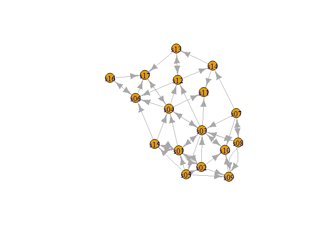<!-- -->

This initial plot appears straightforward, depicting a well-connected
network without any isolated nodes. To enhance the visualization and
make it more visually appealing, we can add additional features and
customization options to our plot.

``` r
# Calculating the scaling factor for edge width

E(Edge.ig)$weight <- as.numeric(E(Edge.ig)$weight)

max_weight <- max(E(Edge.ig)$weight)
min_weight <- min(E(Edge.ig)$weight)
scaled_weights <- (E(Edge.ig)$weight - min_weight) / (max_weight - min_weight)
scaled_widths <- scaled_weights * 3

plot(Edge.ig,
     main = "Information Media Reference Network",
     directed = TRUE,
     vertex.size = 20,
     vertex.color = "lightblue",
     vertex.label.color = "black",
     vertex.label.size = 0.5,
     vertex.label.position = 2,
     layout = layout_with_fr,
     edge.arrow.size = 0.35,
     edge.color = ifelse(E(Edge.ig)$type == "hyperlink", "orange", "green"),
     edge.width = scaled_widths)

legend("bottomright",
       legend = c("Hyperlink", "Mention"),
       fill = c("orange", "green"))
```

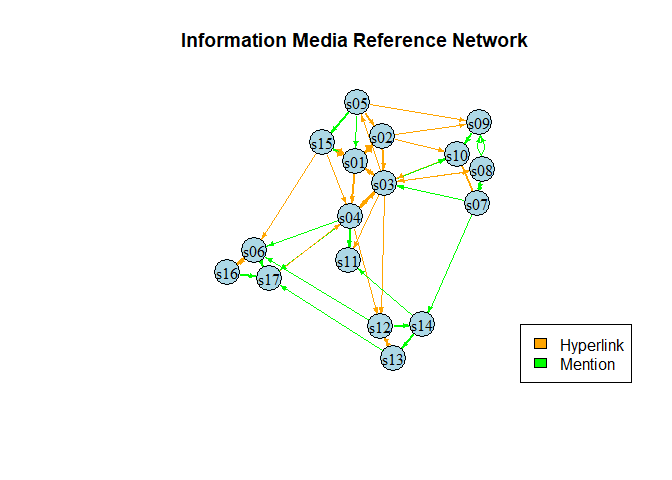<!-- -->

We’ve significantly enhanced the visual appeal of our plot by leveraging
various parameters available in the \`plot\` function. Our improvements
include adjusting the layout for better visualization, altering vertex
size and colors to enhance clarity, and employing distinct edge colors
to distinguish between different types of mentions among references.
Additionally, we utilized edge weights from the graph object to modulate
the width of edges in the plot. This comprehensive approach provides us
with a more comprehensive overview of the network, empowering us to
delve deeper into our analysis with greater clarity and insight.

Integrating node attributes from the node list into the edge list can
significantly enhance the richness and informativeness of network
visualizations. By incorporating additional node attributes into the
edge list, we create more detailed representations of network structure,
associating specific characteristics like platform type or audience size
with each edge. This approach provides a holistic view of patterns and
relationships within the network, enabling targeted analysis and
uncovering nuanced trends. By visualizing node attributes alongside edge
connections, correlations between node characteristics and connection
strength can be identified, offering valuable insights into network
dynamics and behavior. Overall, this integration enhances the
interpretability and utility of network visualizations, facilitating
comprehensive exploration and analysis of complex network datasets.

``` r
# Assigning node attributes to vertices in the edge list

Edge$from <- Node$media[match(Edge$from, Node$id)]
Edge$to <- Node$media[match(Edge$to, Node$id)]

# Plot the network with customized attributes

plot(Edge.ig,
     main = "Information Media Reference Network",
     vertex.color = ifelse(Node$media.type == 1, "lightblue", 
                            ifelse(Node$media.type == 2, "orange", "green")),
     vertex.size = 20,
     vertex.label.size = 0.5,
     vertex.label.position = 2,
     vertex.label.color = "black",
     vertex.label.dist = 0,
     layout = layout_with_fr,
     vertex.label = Node$media,
     edge.color = ifelse(Edge$type == "hyperlink", "red", "blue"),
     edge.arrow.size = 0.25)

legend("bottomright",
       legend = c("Hyperlink", "Mention"),
       fill = c("red", "blue"))
legend("topright",
       legend = c("Newspaper", "TV", "Online"),
       fill = c("lightblue", "orange", "green"))
```

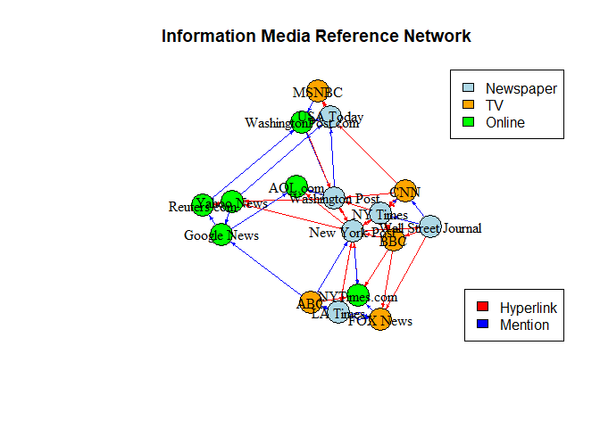<!-- -->

The enhanced visualization provided by the graph above offers a deeper
level of insight and aesthetic appeal. Through the integration of node
attributes, we gain a richer understanding of the network dynamics.
Notably, certain vertices predominantly rely on hyperlinks rather than
direct mentions, suggesting varying modes of communication within the
network. Additionally, nodes such as “New York Times” and “Washington
Post” emerge as central figures, serving as focal points for a
significant volume of references. Further analysis could involve
exploring the degrees of these pivotal nodes and leveraging community
detection algorithms to delineate distinct clusters based on their
patterns of reference propagation. This comprehensive approach promises
to unveil intricate patterns of interaction and communication dynamics
within the network, facilitating a nuanced understanding of its
underlying structure.

## Centrality

Network centrality measures the importance or prominence of nodes within
a network by quantifying their structural positions and connections. In
the context of our research project, which aims to analyze information
networks, understanding centrality metrics is crucial for identifying
influential nodes that play significant roles in information
dissemination and network dynamics. These influential nodes may act as
key opinion leaders, gatekeepers, or hubs, shaping the flow of
information and influencing the behavior of other nodes in the network.
By investigating network centrality, we seek to uncover the underlying
structures and patterns that drive the spread of information, ultimately
contributing to a deeper understanding of network dynamics and
facilitating targeted interventions or strategies for maximizing the
impact of information dissemination efforts.

Let’s begin by examining the density of our network. Network density
quantifies the extent of connections present in a network by measuring
the proportion of actual ties compared to all possible ties within the
network. In our case, the network graph exhibits a density of 0.1875.
This level of network density indicates that approximately 18.75% of all
possible connections among nodes are realized in the network. Whether
this density is considered high or low depends on the specific context
and objectives of our analysis. Generally, a higher density suggests a
more densely connected network, potentially facilitating efficient
information flow and interactions among nodes. Conversely, a lower
density implies a sparser network with fewer connections, which may
indicate more isolated nodes or distinct subgroups within the network.

``` r
# Calculating density for the igraph object

edge_density(Edge.ig, loops = F)
```

    ## [1] 0.1875

Next, we’ll delve into calculating the degrees of nodes within our
network. Understanding node degrees, both in-degree and out-degree, can
provide valuable insights into the flow of references within the
network. In-degree represents the number of incoming references to a
node, indicating its popularity or influence within the network. On the
other hand, out-degree signifies the number of references made by a node
to other nodes, reflecting its activity in disseminating information. By
analyzing node degrees, we can identify the most referenced nodes as
well as those that reference others more frequently, shedding light on
the influential and active entities within the dissemination network.

``` r
# The `degree` command in igraph provides the degrees of nodes along with their names, facilitating easy identification of node degrees. Additionally, it includes self-loops by default, which may not be relevant for our analysis. Therefore, we can set the parameter to false to exclude self-loops from our degree calculations, ensuring a more accurate representation of node degrees within the network.

degree(Edge.ig)
```

    ## s01 s04 s05 s06 s08 s03 s15 s16 s09 s07 s02 s12 s14 s13 s10 s17 s11 
    ##  10   9   5   6   6  13   6   3   5   5   7   6   4   4   5   5   3

``` r
# We'll create a node attributes data frame to store these node characteristics, which will be instrumental for further econometric analysis.

# Obtaining degrees of all nodes
degrees <- degree(Edge.ig)

# Create a data frame with node names and degrees
node_attributes <- data.frame(Node = names(degrees), Degree = degrees, row.names = NULL)

# Ensure the node names are character type
node_attributes$Node <- as.character(node_attributes$Node)

# Print the data frame
print(node_attributes)
```

    ##    Node Degree
    ## 1   s01     10
    ## 2   s04      9
    ## 3   s05      5
    ## 4   s06      6
    ## 5   s08      6
    ## 6   s03     13
    ## 7   s15      6
    ## 8   s16      3
    ## 9   s09      5
    ## 10  s07      5
    ## 11  s02      7
    ## 12  s12      6
    ## 13  s14      4
    ## 14  s13      4
    ## 15  s10      5
    ## 16  s17      5
    ## 17  s11      3

``` r
# Adding the node degrees with the node names in a data frame.

node.attr <- data.frame(Name = Node$media,
                        Degree = node_attributes$Degree[match(Node$id,node_attributes$Node)])

# Printing the Data Frame

print(node.attr)
```

    ##                   Name Degree
    ## 1             NY Times     10
    ## 2      Washington Post      7
    ## 3  Wall Street Journal     13
    ## 4            USA Today      9
    ## 5             LA Times      5
    ## 6        New York Post      6
    ## 7                  CNN      5
    ## 8                MSNBC      6
    ## 9             FOX News      5
    ## 10                 ABC      5
    ## 11                 BBC      3
    ## 12          Yahoo News      6
    ## 13         Google News      4
    ## 14         Reuters.com      4
    ## 15         NYTimes.com      6
    ## 16  WashingtonPost.com      3
    ## 17             AOL.com      5

We can further analyze the individual node degrees to gain insights into
their influence within the network. Currently, it appears that the Wall
Street Journal holds the highest nodal degree at 13, closely followed by
the New York Times. These two sources seem to exert significant
influence within the network. Conversely, ABC News, FOX, and CNN exhibit
the lowest nodal degrees at 5, suggesting lesser prominence or influence
within the network. However, given that our graph is directed,
distinguishing between in-degree and out-degree can provide deeper
insights. In-degree signifies the number of references a node receives,
indicating its influence, while out-degree reflects the number of
references a node makes to other sources, indicating its activity level.
This distinction can further clarify which information sources are most
frequently referenced (thus influential) and which actively reference
other sources.

``` r
# Calculating the in-degree for the nodes in our network

degree(Edge.ig, mode = "in", loops = F)
```

    ## s01 s04 s05 s06 s08 s03 s15 s16 s09 s07 s02 s12 s14 s13 s10 s17 s11 
    ##   5   4   1   4   2   6   2   1   4   1   3   3   2   2   4   4   3

``` r
# Now we can append these values to our node attributes data frame.

# Storing the in-degree values in a data frame

in.degree <- data.frame(Name = names(degree(Edge.ig, mode = "in", loops = F)),
                        Degree = degree(Edge.ig, mode = "in", loops = F), row.names = NULL)

# Appending the in degree values to our node attributes data frame

node.attr <- node.attr %>% 
  mutate("In-Degree" = in.degree$Degree[match(Node$id,in.degree$Name)])

# Now moving on to calculate the out degree of our nodes

degree(Edge.ig, mode = "out", loops = F)
```

    ## s01 s04 s05 s06 s08 s03 s15 s16 s09 s07 s02 s12 s14 s13 s10 s17 s11 
    ##   5   5   4   2   4   7   4   2   1   4   4   3   2   2   1   1   0

``` r
# Appending it to the node attributes data frame

out.degree <- data.frame(Name = names(degree(Edge.ig, mode = "out", loops = F)),
                        Degree = degree(Edge.ig, mode = "out", loops = F), row.names = NULL)

node.attr <- node.attr %>% 
  mutate("Out-Degree" = out.degree$Degree[match(Node$id,out.degree$Name)])

# Doing a Sanity Check to see how our data frame looks like

print(node.attr)
```

    ##                   Name Degree In-Degree Out-Degree
    ## 1             NY Times     10         5          5
    ## 2      Washington Post      7         3          4
    ## 3  Wall Street Journal     13         6          7
    ## 4            USA Today      9         4          5
    ## 5             LA Times      5         1          4
    ## 6        New York Post      6         4          2
    ## 7                  CNN      5         1          4
    ## 8                MSNBC      6         2          4
    ## 9             FOX News      5         4          1
    ## 10                 ABC      5         4          1
    ## 11                 BBC      3         3          0
    ## 12          Yahoo News      6         3          3
    ## 13         Google News      4         2          2
    ## 14         Reuters.com      4         2          2
    ## 15         NYTimes.com      6         2          4
    ## 16  WashingtonPost.com      3         1          2
    ## 17             AOL.com      5         4          1

``` r
# Summary statistics for node attributes.

summary(node.attr)
```

    ##      Name               Degree     In-Degree   Out-Degree
    ##  Length:17          Min.   : 3   Min.   :1   Min.   :0   
    ##  Class :character   1st Qu.: 5   1st Qu.:2   1st Qu.:2   
    ##  Mode  :character   Median : 5   Median :3   Median :3   
    ##                     Mean   : 6   Mean   :3   Mean   :3   
    ##                     3rd Qu.: 6   3rd Qu.:4   3rd Qu.:4   
    ##                     Max.   :13   Max.   :6   Max.   :7

``` r
# Network In-degree distribution

hist(node.attr$`In-Degree`,
     main = "Information Media Network: In-degree Distribution",
     xlab = "References Received")
```

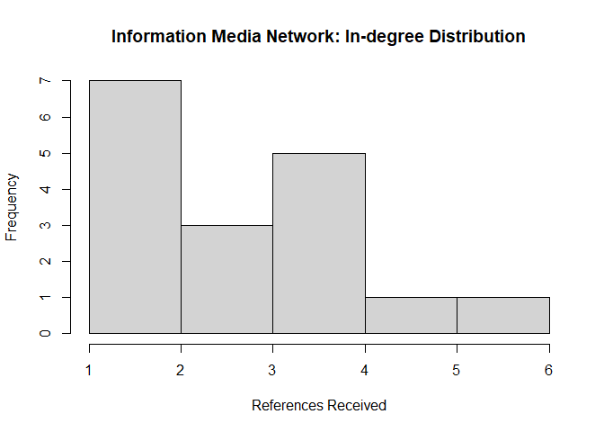<!-- -->

``` r
# Network Out-degree distribution

hist(node.attr$`Out-Degree`,
     main = "Information Media Network: Out-degree Distribution",
     xlab = "References Made")
```

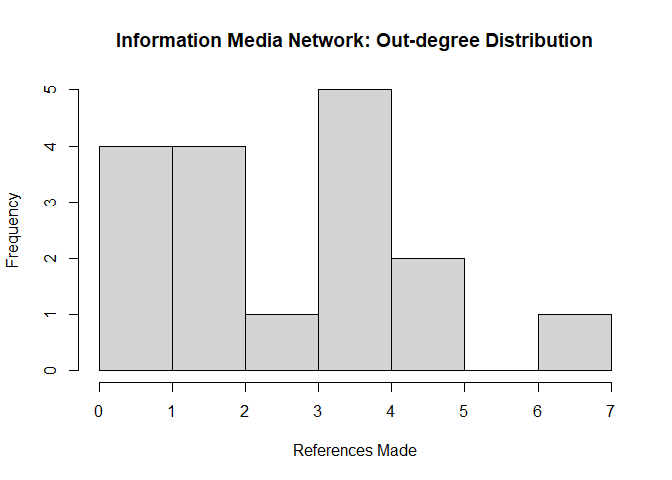<!-- -->

Now that we have constructed this data frame, we can examine the degree
values for all nodes, including their total, in, and out degrees. Upon
initial inspection, it’s apparent that the Wall Street Journal, NY
Times, and USA Today are the top three information sources with the
highest total degree values. This indicates their significant influence
within the media reference networks. Additionally, an intriguing
observation is that all three are newspapers, highlighting the enduring
prominence of print media as primary information sources. Conversely,
ABC, Fox News, and CNN have the lowest total degree values, each at 5.
Remarkably, these three are television channels, suggesting a
comparatively lower activity level in referencing other media and
information platforms.

Let’s delve into the activity of referencing other media platforms by
examining the out-degree. The out-degree signifies the links outgoing
from the media platform to other platforms. From the data, we observe
that the Wall Street Journal, NY Times, and USA Today exhibit the
highest out degrees, with the Wall Street Journal leading with 7 links.
This implies that these newspapers are the most active in referencing
other media platforms in the network.

Similarly, analyzing the in-degree of the nodes allows us to identify
which media platforms are the most influential, as they are referred to
by others. Once again, the Wall Street Journal and NY Times lead in
degrees, with 6 and 5 ties, respectively. However, other platforms such
as USA Today, New York Post, Fox News, and ABC follow closely with 4
degrees each. It’s promising to see a variety of media platforms being
referenced by others. Nonetheless, the Wall Street Journal and NY Times
emerge as the most influential platforms in terms of information and
media sharing.

Let’s revisit our original hypothesis and assess its significance. Our
initial hypothesis regarding influence in the social network was:

*H1*: Information sources with a larger audience size are likely to have
more connections or references with other media platforms.

Now that we’ve identified the most influential social media platforms
with the largest number of connections in our network graph, we aim to
validate our hypothesis by comparing these nodes’ connection counts with
their audience sizes. The audience sizes of these information media
platforms are available in our nodelist. While these audience sizes are
scaled down for ease of comparison, they accurately represent the
essence of the actual numbers. Let’s review our data frame once more to
identify the media platforms with the largest audiences.

``` r
# Viewing the Nodelist data frame.

head(Node)
```

    ##    id               media media.type type.label audience.size
    ## 1 s01            NY Times          1  Newspaper            20
    ## 2 s02     Washington Post          1  Newspaper            25
    ## 3 s03 Wall Street Journal          1  Newspaper            30
    ## 4 s04           USA Today          1  Newspaper            32
    ## 5 s05            LA Times          1  Newspaper            20
    ## 6 s06       New York Post          1  Newspaper            50

``` r
# Viewing the relevant columns and arranging in descending order of audience size.

Node %>% 
  select("media","audience.size","type.label") %>% 
  arrange(desc(audience.size))
```

    ##                  media audience.size type.label
    ## 1             FOX News            60         TV
    ## 2                  CNN            56         TV
    ## 3        New York Post            50  Newspaper
    ## 4                MSNBC            34         TV
    ## 5                  BBC            34         TV
    ## 6           Yahoo News            33     Online
    ## 7              AOL.com            33     Online
    ## 8            USA Today            32  Newspaper
    ## 9  Wall Street Journal            30  Newspaper
    ## 10  WashingtonPost.com            28     Online
    ## 11     Washington Post            25  Newspaper
    ## 12         NYTimes.com            24     Online
    ## 13                 ABC            23         TV
    ## 14         Google News            23     Online
    ## 15            NY Times            20  Newspaper
    ## 16            LA Times            20  Newspaper
    ## 17         Reuters.com            12     Online

From the data frame, it’s evident that Fox News and CNN, both television
channels, boast the largest audience sizes. This aligns with
contemporary trends, where video sources dominate information
consumption. Following closely is the New York Post, a longstanding and
trusted newspaper. Surprisingly, some of the most influential platforms
in our network, like The Wall Street Journal, have relatively smaller
audience sizes compared to television channels. Despite this,
influential nodes such as The Wall Street Journal, The New York Times,
and USA Today don’t necessarily possess the highest audience sizes.
Based on this evidence, we can refute our initial hypothesis, which
suggested that the most influential media platforms, with the highest
number of connections, would also have the largest audience sizes.

For our secondary hypothesis we will need to utilize community detection
algorithms but before delving into community detection algorithms to
group our information media nodes based on shared properties, let’s
explore centrality concepts to better understand our graph. Calculating
various centralities for our nodes and appending them to our node
attributes data set will provide valuable insights. Centrality measures,
such as degree centrality and betweenness centrality, are crucial for
understanding the structural importance of nodes within a network. They
help identify key nodes that play significant roles in information
dissemination, influence, and network connectivity. By analyzing
centrality measures, we can uncover pivotal nodes and gain a deeper
understanding of the underlying network dynamics and relationships.

### Degree Centralization

``` r
# Calculating In-degree centralization for the network

igraph::centr_degree(Edge.ig, loops = FALSE, mode = "in")$centralization
```

    ## [1] 0.1992188

``` r
# Calculating Out-degree centralization for the network

igraph::centr_degree(Edge.ig, loops = FALSE, mode = "out")$centralization
```

    ## [1] 0.265625

As observed, the degree centralization for the network indicates a
higher out degree centralization compared to in degree centralization.
This suggests that there is greater variation in the number of outgoing
connections among nodes than in incoming connections. In other words,
certain nodes exert more influence by referencing or linking to other
media platforms more frequently than others, contributing to a more
centralized structure in terms of outgoing connections. This information
provides insights into the distribution of influence and connectivity
within the network, highlighting nodes that play significant roles in
disseminating information and shaping network dynamics.

### Closeness Centrality

``` r
# Calculating the node level attribute of closeness centrality.

closeness(Edge.ig)
```

    ##         s01         s04         s05         s06         s08         s03 
    ## 0.002666667 0.002645503 0.002754821 0.001342282 0.004672897 0.005208333 
    ##         s15         s16         s09         s07         s02         s12 
    ## 0.003184713 0.001338688 0.001808318 0.006134969 0.003584229 0.001508296 
    ##         s14         s13         s10         s17         s11 
    ## 0.001457726 0.002341920 0.004504505 0.002272727         NaN

``` r
close.centr <- data_frame(Name = names(closeness(Edge.ig)),
                          Centrality = closeness(Edge.ig))
```

    ## Warning: `data_frame()` was deprecated in tibble 1.1.0.
    ## ℹ Please use `tibble()` instead.
    ## This warning is displayed once every 8 hours.
    ## Call `lifecycle::last_lifecycle_warnings()` to see where this warning was
    ## generated.

``` r
# Now, we can integrate the values of closeness centrality into our node attributes data frame to enhance our statistical analysis.

node.attr <- node.attr %>% 
  mutate(Closeness = close.centr$Centrality[match(Node$id,close.centr$Name)])

head(node.attr)
```

    ##                  Name Degree In-Degree Out-Degree   Closeness
    ## 1            NY Times     10         5          5 0.002666667
    ## 2     Washington Post      7         3          4 0.003584229
    ## 3 Wall Street Journal     13         6          7 0.005208333
    ## 4           USA Today      9         4          5 0.002645503
    ## 5            LA Times      5         1          4 0.002754821
    ## 6       New York Post      6         4          2 0.001342282

``` r
node.attr %>% 
  arrange(desc(Closeness)) %>% 
  head()
```

    ##                  Name Degree In-Degree Out-Degree   Closeness
    ## 1                 CNN      5         1          4 0.006134969
    ## 2 Wall Street Journal     13         6          7 0.005208333
    ## 3               MSNBC      6         2          4 0.004672897
    ## 4                 ABC      5         4          1 0.004504505
    ## 5     Washington Post      7         3          4 0.003584229
    ## 6         NYTimes.com      6         2          4 0.003184713

Closeness centrality measures how close a node is to all other nodes in
a network, based on the sum of the shortest paths between that node and
all others. In our data frame, CNN exhibits the highest closeness
centrality of 0.006, followed by the Wall Street Journal and MSNBC. This
indicates that CNN is centrally positioned within the network, with
shorter average distances to other nodes compared to Wall Street Journal
and MSNBC.

### Betweenness Centrality

``` r
# Calculating the node level attribute of betweenness centrality.

betweenness(Edge.ig)
```

    ##        s01        s04        s05        s06        s08        s03        s15 
    ##  34.000000  91.333333  49.000000  21.500000  14.000000 145.833333   2.333333 
    ##        s16        s09        s07        s02        s12        s14        s13 
    ##   0.000000   0.000000   0.500000  23.666667  45.500000   1.000000  21.500000 
    ##        s10        s17        s11 
    ##  48.000000  66.000000   0.000000

``` r
bet.centr <- data_frame(Name = names(betweenness(Edge.ig)),
                          Bet.Centrality = betweenness(Edge.ig))

# Now, we can integrate the values of betweenness centrality into our node attributes data frame to enhance our statistical analysis.

node.attr <- node.attr %>% 
  mutate(Betweenness = bet.centr$Bet.Centrality[match(Node$id,bet.centr$Name)])

head(node.attr)
```

    ##                  Name Degree In-Degree Out-Degree   Closeness Betweenness
    ## 1            NY Times     10         5          5 0.002666667    34.00000
    ## 2     Washington Post      7         3          4 0.003584229    23.66667
    ## 3 Wall Street Journal     13         6          7 0.005208333   145.83333
    ## 4           USA Today      9         4          5 0.002645503    91.33333
    ## 5            LA Times      5         1          4 0.002754821    49.00000
    ## 6       New York Post      6         4          2 0.001342282    21.50000

``` r
node.attr %>%
  select(Name,Betweenness) %>% 
  arrange(desc(Betweenness)) %>% 
  head()
```

    ##                  Name Betweenness
    ## 1 Wall Street Journal   145.83333
    ## 2           USA Today    91.33333
    ## 3             AOL.com    66.00000
    ## 4            LA Times    49.00000
    ## 5                 ABC    48.00000
    ## 6          Yahoo News    45.50000

Betweenness centrality measures the number of shortest paths between
pairs of nodes that pass through a particular node. In our data set,
Wall Street Journal exhibits the highest betweenness centrality score of
145, significantly higher than USA Today and AOL.com. This suggests that
Wall Street Journal plays a crucial role in facilitating information
flow within the network, as it lies on many shortest paths between other
nodes. This finding supports our hypothesis that influential nodes may
not necessarily have the largest audience sizes.

Before proceeding to community detection in our network graph, let’s
generate a correlation plot using the four node attributes we’ve
collected: in-degree, out-degree, closeness centrality, and betweenness
centrality scores. This analysis will reveal the extent of correlation
among these scores.

``` r
# Loading in the required library.

library(corrr)
```

    ## Warning: package 'corrr' was built under R version 4.2.3

``` r
# Plotting the correlation graph.

node.attr %>% 
  select(-c(1,2)) %>% 
  correlate() %>% 
  
  arrange() %>% 
  rplot()
```

    ## Correlation computed with
    ## • Method: 'pearson'
    ## • Missing treated using: 'pairwise.complete.obs'

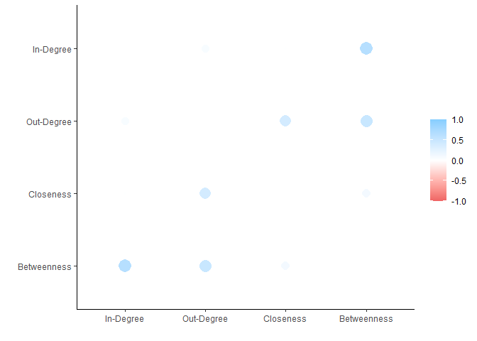<!-- -->

The correlation plot illustrates a strong positive correlation between
betweenness scores and in-degree scores, indicating that nodes with more
incoming ties tend to have higher betweenness centrality scores. While
there is some correlation between out-degree and both betweenness and
closeness centrality scores, it is not as pronounced as the former
relationship. This analysis provides valuable insights into the
interplay between different centrality measures and their effects on one
another.

Before proceeding further, let’s create another visualization by
plotting the network graph with betweenness centrality and degree
centrality as node attributes. This will highlight the distinct nodes
that are more influential than others in the network.

``` r
# Using betweenness centrality scores to determine node sizes.

plot(Edge.ig,
     main = "Information Media Reference Network: Betweenness Centrality",
     vertex.color = ifelse(Node$media.type == 1, "lightblue", 
                            ifelse(Node$media.type == 2, "orange", "green")),
     vertex.size = node.attr$Betweenness*0.25,
     vertex.label.size = 0.5,
     vertex.label.position = 2,
     vertex.label.color = "black",
     vertex.label.dist = 0,
     layout = layout_with_fr,
     vertex.label = Node$media,
     edge.color = ifelse(Edge$type == "hyperlink", "red", "blue"),
     edge.arrow.size = 0.25)

legend("bottomright",
       legend = c("Hyperlink", "Mention"),
       fill = c("red", "blue"))
legend("topright",
       legend = c("Newspaper", "TV", "Online"),
       fill = c("lightblue", "orange", "green"))
```

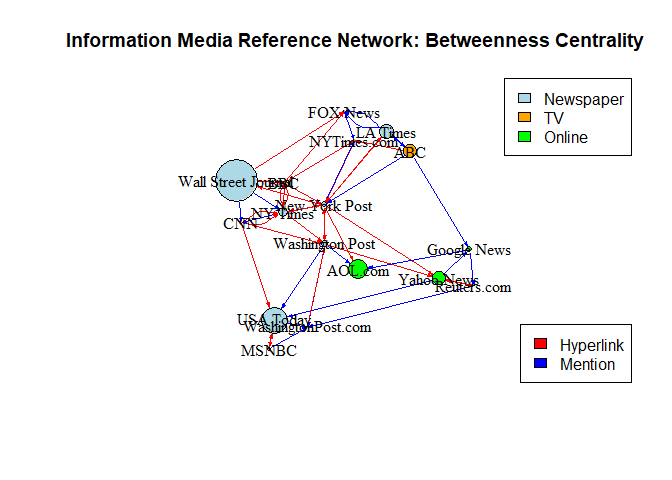<!-- -->

The graph clearly illustrates that newspapers have higher betweenness
centrality values compared to television or online sources of
information. This indicates that newspapers play a significant role in
the information media reference networks. Now, let’s utilize the total
degree scores of the nodes to further highlight the distinctiveness in
the plot.

``` r
# Using total degree scores to determine node sizes.

plot(Edge.ig,
     main = "Information Media Reference Network: Total Degree",
     vertex.color = ifelse(Node$media.type == 1, "lightblue", 
                            ifelse(Node$media.type == 2, "orange", "green")),
     vertex.size = node.attr$Degree*2.25,
     vertex.label.size = 0.5,
     vertex.label.position = 2,
     vertex.label.color = "black",
     vertex.label.dist = 0,
     layout = layout_with_fr,
     vertex.label = Node$media,
     edge.color = ifelse(Edge$type == "hyperlink", "red", "blue"),
     edge.arrow.size = 0.25)

legend("bottomright",
       legend = c("Hyperlink", "Mention"),
       fill = c("red", "blue"))
legend("topright",
       legend = c("Newspaper", "TV", "Online"),
       fill = c("lightblue", "orange", "green"))
```

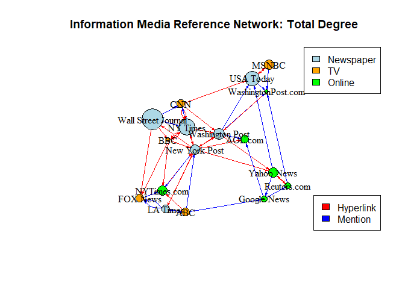<!-- -->

Once more, this graph emphasizes that newspapers exhibit a higher total
degree of centrality compared to television and online information
sources. This underscores the central role of newspapers in these
reference-sharing networks for information media platforms.

## Community Detection

Community detection algorithms play a crucial role in analyzing networks
by identifying clusters or communities of nodes that share similar
attributes or behaviors. These algorithms use various parameters such as
modularity, edge betweenness, and eigenvector centrality to group nodes
into subgraphs based on their similarities. Understanding these
communities can provide insights into the structure and dynamics of the
network, helping to uncover patterns and relationships among nodes.

One of the commonly used community detection algorithms is the walk trap
algorithm, which detects dense subgraphs based on random walks across
the network. It can handle a weights argument, which makes it a good
tool for weighted networks. Higher weights increase the probability that
a random walk goes in that direction versus the direction of a tie with
a lower weight.

By employing community detection algorithms, we can gain valuable
insights into the organization and functioning of complex networks, such
as information media reference networks. These insights can help us
address research questions and hypotheses, such as identifying distinct
clusters of information sources based on media type and interaction
patterns.

### Walk Trap Community Detection

``` r
# Creating a walk trap community object using the algorithm.

# Assign media platform names as vertex attributes

vertex_attr(Edge.ig, "name") <- Node$media

Comm.wt <- igraph::cluster_walktrap(Edge.ig,
                                    weights = E(Edge.ig)$weight)
Comm.wt
```

    ## IGRAPH clustering walktrap, groups: 4, mod: 0.6
    ## + groups:
    ##   $`1`
    ##   [1] "NY Times"            "Washington Post"     "Wall Street Journal"
    ##   [4] "New York Post"       "CNN"                 "BBC"                
    ##   [7] "AOL.com"            
    ##   
    ##   $`2`
    ##   [1] "LA Times"    "FOX News"    "ABC"         "NYTimes.com"
    ##   
    ##   $`3`
    ##   [1] "USA Today"          "MSNBC"              "WashingtonPost.com"
    ##   + ... omitted several groups/vertices

``` r
# Identifying the various groups of nodes created by the algorithm.

igraph::groups(Comm.wt)
```

    ## $`1`
    ## [1] "NY Times"            "Washington Post"     "Wall Street Journal"
    ## [4] "New York Post"       "CNN"                 "BBC"                
    ## [7] "AOL.com"            
    ## 
    ## $`2`
    ## [1] "LA Times"    "FOX News"    "ABC"         "NYTimes.com"
    ## 
    ## $`3`
    ## [1] "USA Today"          "MSNBC"              "WashingtonPost.com"
    ## 
    ## $`4`
    ## [1] "Yahoo News"  "Google News" "Reuters.com"

As observed from the community object, entities such as NY Times,
Washington Post, Wall Street Journal, New York Post, CNN, BBC, and
AOL.com are grouped together within the same community. This algorithm
considers edge weights and employs random walk algorithms to form these
groups. Notably, this community comprises four newspapers, two
television channels, and one online platform, suggesting a mix of media
types within a single group. This finding challenges our initial
hypothesis that similar media types would cluster together in the media
reference graph.

Moving forward, let’s explore how the next algorithm clusters our nodes.
Before proceeding, let’s attempt to visualize the Walktrap community
object to gain insights into its structure.

``` r
# Plotting the walk trap community object.

plot(Comm.wt,Edge.ig,
     main = "Walk Trap Community Detection",
     vertex.size = 10,
     vertex.label.size = 0.5,
     vertex.label.position = 2,
     vertex.label.color = "black",
     vertex.label.dist = 0,
     layout = layout_with_fr,
     edge.color = ifelse(Edge$type == "hyperlink", "red", "blue"),
     edge.arrow.size = 0.25)

legend("bottomright",
       legend = c("Hyperlink", "Mention"),
       fill = c("red", "blue"))
```

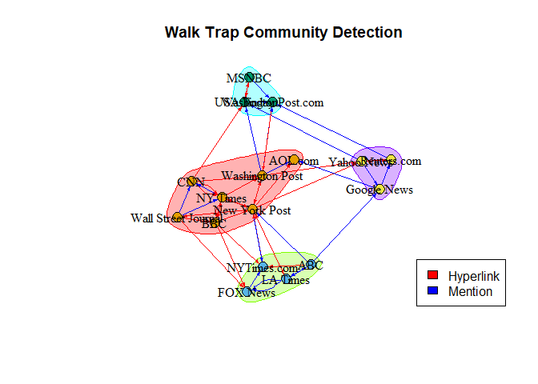<!-- -->

Before adding the community cluster membership to our original node
attributes data frame, we need to ensure that the nodes are in the same
order as the original nodes. This ensures that the community memberships
correspond correctly to each node.

``` r
# Calculating modularity score of the walk trap community.

modularity(Comm.wt)
```

    ## [1] 0.5972482

``` r
# 0.597 is a high modularity score and defines that the nodes and clusters are highly dense and concentrated.
```

``` r
# Checking the order of nodes in the membership vector and original graph object.

membership(Comm.wt)
```

    ##            NY Times     Washington Post Wall Street Journal           USA Today 
    ##                   1                   1                   1                   3 
    ##            LA Times       New York Post                 CNN               MSNBC 
    ##                   2                   1                   1                   3 
    ##            FOX News                 ABC                 BBC          Yahoo News 
    ##                   2                   2                   1                   4 
    ##         Google News         Reuters.com         NYTimes.com  WashingtonPost.com 
    ##                   4                   4                   2                   3 
    ##             AOL.com 
    ##                   1

``` r
V(Edge.ig)$name
```

    ##  [1] "NY Times"            "Washington Post"     "Wall Street Journal"
    ##  [4] "USA Today"           "LA Times"            "New York Post"      
    ##  [7] "CNN"                 "MSNBC"               "FOX News"           
    ## [10] "ABC"                 "BBC"                 "Yahoo News"         
    ## [13] "Google News"         "Reuters.com"         "NYTimes.com"        
    ## [16] "WashingtonPost.com"  "AOL.com"

``` r
# It seems like both share the same order of nodes so now we can move on to adding the membership data into our dataset.

node.attr$Comm.wt <- Comm.wt$membership

node.attr %>% 
  select(c(1,7)) %>% 
  head()
```

    ##                  Name Comm.wt
    ## 1            NY Times       1
    ## 2     Washington Post       1
    ## 3 Wall Street Journal       1
    ## 4           USA Today       3
    ## 5            LA Times       2
    ## 6       New York Post       1

### Edge Betweenness Community Detection

Edge betweenness community detection algorithm identifies communities
with sparse connections between them by eliminating high-betweenness
nodes. We will use the \`weights\` argument and set \`directed = TRUE\`
for our graph. This will optimize the algorithm’s performance in
creating clusters and subgraphs.

``` r
# Creating an edge betweenness community object using the algorithm.

Comm.edge <- igraph::cluster_edge_betweenness(Edge.ig,
                                    weights = E(Edge.ig)$weight,
                                    directed = TRUE)
```

    ## Warning in igraph::cluster_edge_betweenness(Edge.ig, weights =
    ## E(Edge.ig)$weight, : At vendor/cigraph/src/community/edge_betweenness.c:497 :
    ## Membership vector will be selected based on the highest modularity score.

``` r
Comm.edge
```

    ## IGRAPH clustering edge betweenness, groups: 3, mod: 0.29
    ## + groups:
    ##   $`1`
    ##   [1] "NY Times"            "Wall Street Journal" "LA Times"           
    ##   [4] "New York Post"       "CNN"                 "FOX News"           
    ##   [7] "ABC"                 "BBC"                 "NYTimes.com"        
    ##   
    ##   $`2`
    ##   [1] "Washington Post"    "USA Today"          "MSNBC"             
    ##   [4] "Yahoo News"         "Reuters.com"        "WashingtonPost.com"
    ##   
    ##   $`3`
    ##   + ... omitted several groups/vertices

``` r
# Identifying the various groups of nodes created by the algorithm.

igraph::groups(Comm.edge)
```

    ## $`1`
    ## [1] "NY Times"            "Wall Street Journal" "LA Times"           
    ## [4] "New York Post"       "CNN"                 "FOX News"           
    ## [7] "ABC"                 "BBC"                 "NYTimes.com"        
    ## 
    ## $`2`
    ## [1] "Washington Post"    "USA Today"          "MSNBC"             
    ## [4] "Yahoo News"         "Reuters.com"        "WashingtonPost.com"
    ## 
    ## $`3`
    ## [1] "Google News" "AOL.com"

We observe that the NY Times, Wall Street Journal, LA Times, New York
Post, CNN, FOX News, ABC, BBC, and NYTimes.com are grouped. This cluster
encompasses various media platforms, including newspapers, online
platforms, and television channels. Interestingly, the edge betweenness
algorithm yielded three groups, whereas the walk trap algorithm resulted
in four groups. While these divisions are algorithm-specific, they do
not align with our second hypothesis.

``` r
# Plotting the edge betweenness community object.

plot(Comm.edge,Edge.ig,
     main = "Edge Betweenness Community Detection",
     vertex.size = 10,
     vertex.label.size = 0.5,
     vertex.label.position = 2,
     vertex.label.color = "black",
     vertex.label.dist = 0,
     layout = layout_with_fr,
     edge.color = ifelse(Edge$type == "hyperlink", "red", "blue"),
     edge.arrow.size = 0.25)

legend("bottomright",
       legend = c("Hyperlink", "Mention"),
       fill = c("red", "blue"))
```

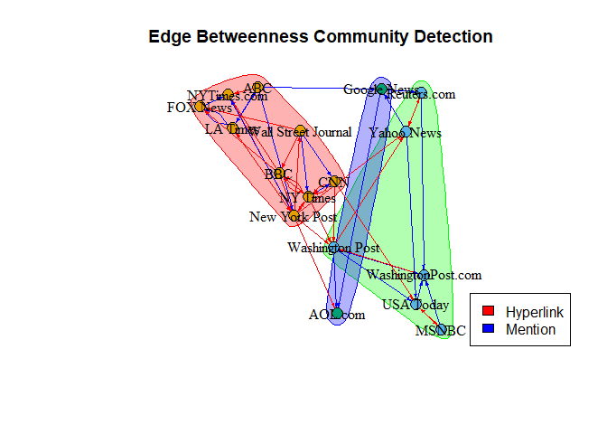<!-- -->

Next, we will calculate the modularity score for the edge betweenness
community and compare it with scores obtained from other algorithms
later. Additionally, we will include the group membership information in
the original node attributes data frame for further analysis.

``` r
# Calculating modularity score of the edge betweenness community.

modularity(Comm.edge)
```

    ## [1] 0.2907512

``` r
# 0.290 is a low modularity score and defines that the nodes and clusters are not highly dense and concentrated.
```

``` r
# Checking the order of nodes in the membership vector and original graph object.

membership(Comm.edge)
```

    ##            NY Times     Washington Post Wall Street Journal           USA Today 
    ##                   1                   2                   1                   2 
    ##            LA Times       New York Post                 CNN               MSNBC 
    ##                   1                   1                   1                   2 
    ##            FOX News                 ABC                 BBC          Yahoo News 
    ##                   1                   1                   1                   2 
    ##         Google News         Reuters.com         NYTimes.com  WashingtonPost.com 
    ##                   3                   2                   1                   2 
    ##             AOL.com 
    ##                   3

``` r
V(Edge.ig)$name
```

    ##  [1] "NY Times"            "Washington Post"     "Wall Street Journal"
    ##  [4] "USA Today"           "LA Times"            "New York Post"      
    ##  [7] "CNN"                 "MSNBC"               "FOX News"           
    ## [10] "ABC"                 "BBC"                 "Yahoo News"         
    ## [13] "Google News"         "Reuters.com"         "NYTimes.com"        
    ## [16] "WashingtonPost.com"  "AOL.com"

``` r
# It seems like both share the same order of nodes so now we can move on to adding the membership data into our dataset.

node.attr$Comm.edge <- Comm.edge$membership

node.attr %>% 
  select(c(1,8)) %>% 
  head()
```

    ##                  Name Comm.edge
    ## 1            NY Times         1
    ## 2     Washington Post         2
    ## 3 Wall Street Journal         1
    ## 4           USA Today         2
    ## 5            LA Times         1
    ## 6       New York Post         1

### EigenVector Community Detection

The leading eigenvector community detection method relies on the
eigenvectors of the modularity matrix of the network. Given that our
network is weighted, we utilize the standard weight option or an
appropriately named “weights” edge attribute. This algorithm is
particularly effective in identifying communities within the network.
Let’s examine the communities created by this method and analyze their
characteristics.

``` r
# Creating an eigenvector community object using the algorithm.

Comm.eigen <- igraph::leading.eigenvector.community(Edge.ig,
                                    weights = E(Edge.ig)$weight)
```

    ## Warning: `leading.eigenvector.community()` was deprecated in igraph 2.0.0.
    ## ℹ Please use `cluster_leading_eigen()` instead.
    ## This warning is displayed once every 8 hours.
    ## Call `lifecycle::last_lifecycle_warnings()` to see where this warning was
    ## generated.

    ## Warning in cluster_leading_eigen(graph = graph, steps = steps, weights =
    ## weights, : At vendor/cigraph/src/community/leading_eigenvector.c:392 : Directed
    ## graph supplied, edge directions will be ignored.

``` r
Comm.eigen
```

    ## IGRAPH clustering leading eigenvector, groups: 4, mod: 0.6
    ## + groups:
    ##   $`1`
    ##   [1] "NY Times"            "Washington Post"     "Wall Street Journal"
    ##   [4] "New York Post"       "CNN"                 "BBC"                
    ##   [7] "AOL.com"            
    ##   
    ##   $`2`
    ##   [1] "USA Today"          "MSNBC"              "WashingtonPost.com"
    ##   
    ##   $`3`
    ##   [1] "LA Times"    "FOX News"    "ABC"         "NYTimes.com"
    ##   + ... omitted several groups/vertices

``` r
# Identifying the various groups of nodes created by the algorithm.

igraph::groups(Comm.eigen)
```

    ## $`1`
    ## [1] "NY Times"            "Washington Post"     "Wall Street Journal"
    ## [4] "New York Post"       "CNN"                 "BBC"                
    ## [7] "AOL.com"            
    ## 
    ## $`2`
    ## [1] "USA Today"          "MSNBC"              "WashingtonPost.com"
    ## 
    ## $`3`
    ## [1] "LA Times"    "FOX News"    "ABC"         "NYTimes.com"
    ## 
    ## $`4`
    ## [1] "Yahoo News"  "Google News" "Reuters.com"

The groups identified by the eigenvector community detection algorithm
closely resemble those detected by the walk trap community detection
algorithm. Both algorithms partition the network into four distinct
subgroups, with identical participants across all groups. However, to
further analyze the effectiveness of this algorithm, we will assess its
modularity score and incorporate the membership values into the original
node attributes dataset.

``` r
# Calculating modularity score of the eigen vector community.

modularity(Comm.eigen)
```

    ## [1] 0.5972482

``` r
# 0.597 is a high modularity score and defines that the nodes and clusters are highly dense and concentrated. This is exactly the same modularity score as the walk trap community detection.
```

``` r
# Checking the order of nodes in the membership vector and original graph object.

membership(Comm.eigen)
```

    ##            NY Times     Washington Post Wall Street Journal           USA Today 
    ##                   1                   1                   1                   2 
    ##            LA Times       New York Post                 CNN               MSNBC 
    ##                   3                   1                   1                   2 
    ##            FOX News                 ABC                 BBC          Yahoo News 
    ##                   3                   3                   1                   4 
    ##         Google News         Reuters.com         NYTimes.com  WashingtonPost.com 
    ##                   4                   4                   3                   2 
    ##             AOL.com 
    ##                   1

``` r
V(Edge.ig)$name
```

    ##  [1] "NY Times"            "Washington Post"     "Wall Street Journal"
    ##  [4] "USA Today"           "LA Times"            "New York Post"      
    ##  [7] "CNN"                 "MSNBC"               "FOX News"           
    ## [10] "ABC"                 "BBC"                 "Yahoo News"         
    ## [13] "Google News"         "Reuters.com"         "NYTimes.com"        
    ## [16] "WashingtonPost.com"  "AOL.com"

``` r
# It seems like both share the same order of nodes so now we can move on to adding the membership data into our dataset.

node.attr$Comm.eigen <- Comm.eigen$membership

node.attr %>% 
  select(c(1,9)) %>% 
  head()
```

    ##                  Name Comm.eigen
    ## 1            NY Times          1
    ## 2     Washington Post          1
    ## 3 Wall Street Journal          1
    ## 4           USA Today          2
    ## 5            LA Times          3
    ## 6       New York Post          1

``` r
# Plotting the eigen betweenness community object.

plot(Comm.eigen,Edge.ig,
     main = "Eigen Vector Community Detection",
     vertex.size = 10,
     vertex.label.size = 0.5,
     vertex.label.position = 2,
     vertex.label.color = "black",
     vertex.label.dist = 0,
     layout = layout_with_fr,
     edge.color = ifelse(Edge$type == "hyperlink", "red", "blue"),
     edge.arrow.size = 0.25)

legend("bottomright",
       legend = c("Hyperlink", "Mention"),
       fill = c("red", "blue"))
```

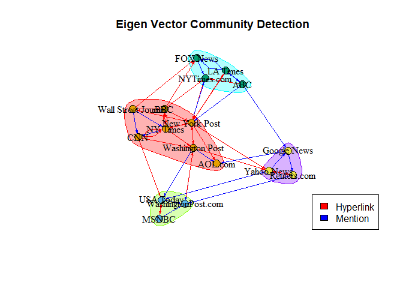<!-- -->

After experimenting with various community detection algorithms, we’ve
gained insights into the diverse clusters within our network. It’s
intriguing to observe the variability and distinctions within the same
network, driven by the parameters used for grouping. With this
understanding, we can refine our second hypothesis:

*H2*: Distinct clusters of information sources may emerge based on the
media type and the nature of their interactions (e.g., hyperlinks or
mentions).

Our analysis reveals that the clusters aren’t solely determined by media
type. Instead, we find groups comprising various media formats,
including newspapers, television, and online platforms. Additionally,
our assumption regarding distinctive groups formed by link types holds
true to some extent. Certain clusters emerge based on centrality
measures related to weighted edges and eigenvector values.

Considering these findings, we can’t outright dismiss our second
hypothesis. While the clustering isn’t solely driven by media type,
there’s evidence suggesting that nodes do form distinctive groups based
on shared properties such as the number of incoming and outgoing ties,
as well as centrality values.

This nuanced understanding underscores the complexity of information
dissemination networks and warrants further exploration into the
interplay between media types and interaction dynamics.

## Conclusion

In conclusion, our social network analysis project provided valuable
insights into the intricate dynamics of information dissemination
networks. We employed a comprehensive array of techniques, beginning
with an exploration of the network’s descriptive properties. By studying
degree centralization, in and out degree centrality, betweenness, and
closeness centralization, we gained a deeper understanding of the
network’s structure and connectivity.

Graph plotting played a crucial role in visualizing these metrics,
facilitating better interpretation and analysis. Furthermore, we
utilized network clustering algorithms to identify distinct clusters and
subgroups within the network. Calculating modularity scores and
comparing algorithms enabled us to assess the effectiveness of different
clustering approaches.

Throughout our analysis, we sought to validate our hypotheses regarding
the nature of information source clusters within the network. While we
found evidence supporting our second hypothesis—that distinct clusters
emerge based on shared properties—the findings led us to reject our
initial hypothesis, which posited a correlation between audience size
and network centrality.

Undoubtedly, the journey through network graph statistics was both
enlightening and challenging. While our analysis provided valuable
insights, uncovering meaningful patterns and ideas within complex
network structures requires continued effort and resources. Moving
forward, further exploration and research will be necessary to gain
deeper insights into the functioning of information media platforms’
network systems.
